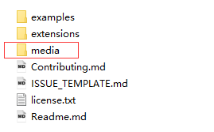
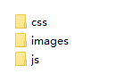
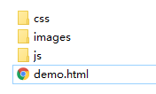
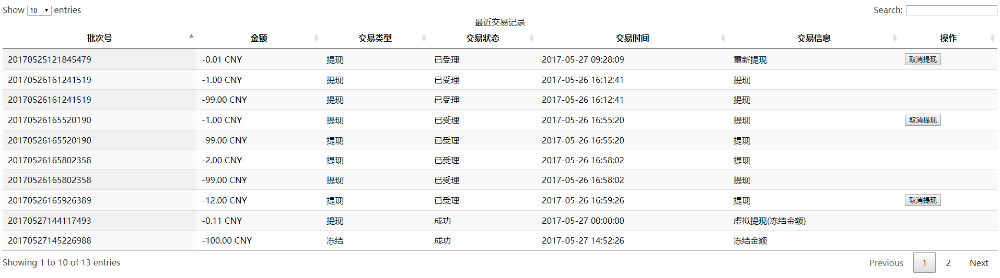
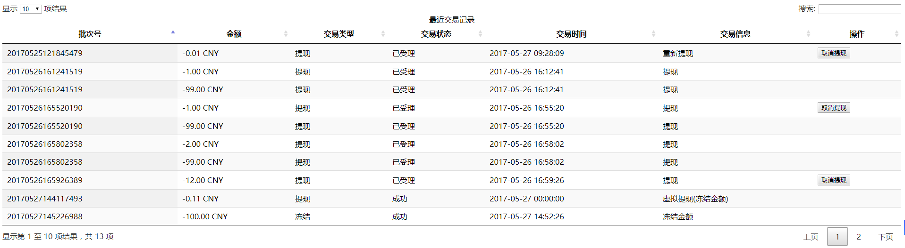
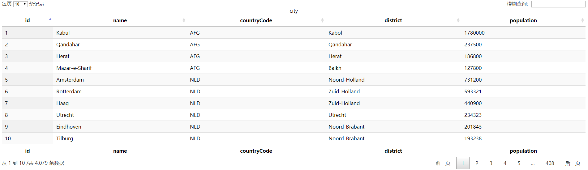

# 简介
Datatables是一款jquery表格插件。它是一个高度灵活的工具，可以将任何HTML表格添加高级的交互功能。


* 分页，即时搜索和排序
* 几乎支持任何数据源：DOM， javascript， Ajax 和 服务器处理
* 支持不同主题 DataTables, jQuery UI, Bootstrap, Foundation
* 各式各样的扩展: Editor, TableTools, FixedColumns ……
* 丰富多样的option和强大的API
* 支持国际化
* 超过2900+个单元测试
* 免费开源 （ MIT license ）！ 商业支持
* 更多特性请到[DataTables中文网](http://www.datatables.club/)查看

# 下载
可以到[DataTables中文网](http://www.datatables.club/)下载最新版本的文档。

下载完目录如下：


我们将使用media目录下的文件。


# 简单使用
在项目中使用Datatables，只需要引用三个文件即可，jQuery库，一个DT的核心js文件和一个DT的css文件。

## demo目录


## demo.html
```
<!DOCTYPE HTML>
<html>
	<head>
		<title>DataTables Demo</title>
		<meta http-equiv="Content-Type" content="text/html; charset=utf-8" />
		<link rel="stylesheet" href="css/jquery.dataTables.css"></link>
	</head>
	<body>
		<table id="table_id_example" class="display">
			<caption>最近交易记录</caption>
		</table>
	</body>
	
	<script src="js/jquery.js"></script>
	<script src="js/jquery.dataTables.js"></script>
	<script src="js/demo.js"></script>
</html>
```

## demo.js
```
$(document).ready( function () {
	var data = [
        [
            "20170527150032890",
            "-0.10  CNY",
            "提现",
            "失败",
            "2017-05-27 15:00:32",
            "提现",
			""
        ],
        [
            "20170527145824609",
            "-3.00  CNY",
            "冻结",
            "成功",
            "2017-05-27 14:58:24",
            "冻结金额",
			""
        ],
		[
            "20170527145704263",
            "-3.00  CNY",
            "提现",
            "失败",
            "2017-05-27 14:57:04",
            "提现",
			""
        ],
		[
			"20170527145226988",
			"-100.00  CNY",
			"冻结",
            "成功",
			"2017-05-27 14:52:26",
			"冻结金额",
			""
		],
		[
			"20170525121845479",
			"-0.01 CNY",
			"提现",
            "已受理",
			"2017-05-27 09:28:09",
			"重新提现",
			"<button class='btn btn-warning btn-block' onclick=alert('haha') >取消提现</button>"
		],
		[
			"20170527144117493",
			"-0.11 CNY",
			"提现",
            "成功",
			"2017-05-27 00:00:00",
			"虚拟提现(冻结金额)",
			""
		],
		[
			"20170526165926389",
			"-12.00 CNY",
			"提现",
            "已受理",
			"2017-05-26 16:59:26",
			"提现",
			"<button class='btn btn-warning btn-block' onclick=alert('haha') >取消提现</button>"
		],
		[
			"20170526165802358",
			"-2.00 CNY",
			"提现",
            "已受理",
			"2017-05-26 16:58:02",
			"提现",
			""
		],
		[
			"20170526165520190",
			"-1.00 CNY",
			"提现",
            "已受理",
			"2017-05-26 16:55:20",
			"提现",
			"<button class='btn btn-warning btn-block' onclick=alert('haha') >取消提现</button>"
		],
		[
			"20170526161241519",
			"-1.00 CNY",
			"提现",
            "已受理",
			"2017-05-26 16:12:41",
			"提现",
			""
		],
		[
			"20170526165802358",
			"-99.00 CNY",
			"提现",
            "已受理",
			"2017-05-26 16:58:02",
			"提现",
			""
		],
		[
			"20170526165520190",
			"-99.00 CNY",
			"提现",
            "已受理",
			"2017-05-26 16:55:20",
			"提现",
			""
		],
		[
			"20170526161241519",
			"-99.00 CNY",
			"提现",
            "已受理",
			"2017-05-26 16:12:41",
			"提现",
			""
		]
    ];

    //DataTables 初始化
    $('#table_id_example').DataTable( {
		data: data,
		columns: [
            { title: '批次号' },
            { title: '金额' },
            { title: '交易类型' },
            { title: '交易状态' },
			{ title: '交易时间' },
			{ title: '交易信息' },
			{ title: '操作' }
        ]
    } );
} );
```

## 结果


## 添加国际化
Datatables中所使用的语言选项是通过 language 来配置的。 这是一个对象字符串，通过一个参数来描述Datatables的每个部分。

Datatables默认的是英语，这里我们改成中文。在demo.js文件添加 language 配置项，使其DataTables初始化代码像这样：
```
//DataTables 初始化
$('#table_id_example').DataTable( {
    data: data,
    columns: [
        { title: '批次号' },
        { title: '金额' },
        { title: '交易类型' },
        { title: '交易状态' },
        { title: '交易时间' },
        { title: '交易信息' },
        { title: '操作' }
    ],
    // 国际化
    language: {
        "sProcessing": "处理中...",
        "sLengthMenu": "显示 _MENU_ 项结果",
        "sZeroRecords": "没有匹配结果",
        "sInfo": "显示第 _START_ 至 _END_ 项结果，共 _TOTAL_ 项",
        "sInfoEmpty": "显示第 0 至 0 项结果，共 0 项",
        "sInfoFiltered": "(由 _MAX_ 项结果过滤)",
        "sInfoPostFix": "",
        "sSearch": "搜索:",
        "sUrl": "",
        "sEmptyTable": "表中数据为空",
        "sLoadingRecords": "载入中...",
        "sInfoThousands": ",",
        "oPaginate": {
            "sFirst": "首页",
            "sPrevious": "上页",
            "sNext": "下页",
            "sLast": "末页"
        },
        "oAria": {
            "sSortAscending": ": 以升序排列此列",
            "sSortDescending": ": 以降序排列此列"
        }
    }
} );
```

结果如图


## 关于表列
上面我们的写法是动态添加title
```
columns: [
    { title: '批次号' },
    { title: '金额' },
    { title: '交易类型' },
    { title: '交易状态' },
    { title: '交易时间' },
    { title: '交易信息' },
    { title: '操作' }
]
```

官网是另一种写法，首先在table里写好表列字段名，如：
```
<thead>
    <tr>
        <th>name</th>
        <th>position</th>
        <th>salary</th>
        <th>office</th>
    </tr>
</thead>
```

然后上面columns写法稍微有点不同
```
columns: [
    { data: 'name' },
    { data: 'position' },
    { data: 'salary' },
    { data: 'office' }
]
```

这样也是完全OK的，具体怎么用看自己喜好和实际业务了。

# 服务器支持
一次性处理大量数据DataTables性能会下降，因为 DT 需要渲染，数据越多，速度就越慢。

为了解决这个问题， DataTables 提供了服务器模式，把本来客户端所做的事情交给服务器去处理， 比如排序（order）、分页（paging）、过滤（filter）。

启用服务器模式时，每次请求 DataTables 会向服务器发送一些参数（当前分页，排序，搜索参数等），服务器则返回组装好的数据。

## demo.html
```
<!DOCTYPE HTML>
<html>
	<head>
		<title>DataTables Demo</title>
		<meta http-equiv="Content-Type" content="text/html; charset=utf-8" />
		<link rel="stylesheet" href="css/jquery.dataTables.css"></link>
	</head>
	<body>
		<table id="city" class="display">
			<caption>city</caption>
			<thead>
				<tr>
					<th>id</th>
					<th>name</th>
					<th>countryCode</th>
					<th>district</th>
					<th>population</th>
				</tr>
			</thead>
		</table>
	</body>
	
	<script src="js/jquery.js"></script>
	<script src="js/jquery.dataTables.js"></script>
	<script src="js/demo.js"></script>
</html>
```

## demo.js
```
$(document).ready( function () {
    //DataTables 初始化
    $('#country').DataTable( {
		"processing": true,		//开启加载等待提示，提示信息是下面language中的sProcessing配置
        "serverSide": true,		//打开服务器模式
		"ajax": {
			"url": "city/getall",
			"type": "POST",
			"data": function(d){	//d包含了DataTables发送到服务器的参数，这里还可以根据自己的业务添加参数
                //可以自定义一些业务参数
                //d.xxx = "xxx";
			}
		},
		"columns": [
            { "data": 'id' },
            { "data": 'name' },
            { "data": 'countryCode' },
            { "data": 'district' },
			{ "data": 'population' }
        ],
		// 国际化
		language: {
			"sProcessing": "处理中...",
			"sLengthMenu": "显示 _MENU_ 项结果",
			"sZeroRecords": "没有匹配结果",
			"sInfo": "显示第 _START_ 至 _END_ 项结果，共 _TOTAL_ 项",
			"sInfoEmpty": "显示第 0 至 0 项结果，共 0 项",
			"sInfoFiltered": "(由 _MAX_ 项结果过滤)",
			"sInfoPostFix": "",
			"sSearch": "搜索:",
			"sUrl": "",
			"sEmptyTable": "表中数据为空",
			"sLoadingRecords": "载入中...",
			"sInfoThousands": ",",
			"oPaginate": {
				"sFirst": "首页",
				"sPrevious": "上页",
				"sNext": "下页",
				"sLast": "末页"
			},
			"oAria": {
				"sSortAscending": ": 以升序排列此列",
				"sSortDescending": ": 以降序排列此列"
			}
		}
    } );
} );
```

## 查看结果

在浏览器调试窗口，我们可以看到发送到后台的参数(即上面ajax请求中d的数据)：
```
draw:1	//确保Ajax从服务器返回的是对应的，服务器接收到此参数后再返回
columns[0][data]:id
columns[0][name]:
columns[0][searchable]:true
columns[0][orderable]:true
columns[0][search][value]:
columns[0][search][regex]:false
columns[1][data]:name
columns[1][name]:
columns[1][searchable]:true
columns[1][orderable]:true
columns[1][search][value]:
columns[1][search][regex]:false
columns[2][data]:countryCode
columns[2][name]:
columns[2][searchable]:true
columns[2][orderable]:true
columns[2][search][value]:
columns[2][search][regex]:false
columns[3][data]:district
columns[3][name]:
columns[3][searchable]:true
columns[3][orderable]:true
columns[3][search][value]:
columns[3][search][regex]:false
columns[4][data]:population
columns[4][name]:
columns[4][searchable]:true
columns[4][orderable]:true
columns[4][search][value]:
columns[4][search][regex]:false
order[0][column]:0	//告诉后台那些列是需要排序的
order[0][dir]:asc	//告诉后台列排序的方式， desc 降序 asc 升序
start:0	//第一条数据的起始位置，比如0代表第一条数据
length:10	//告诉服务器每页显示的条数
search[value]:	//全局的搜索条件，此demo为空
search[regex]:false	//为true代表全局搜索的值是作为正则表达式处理
```

服务器返回的数据
```
{
    "recordsFiltered": 4079,	//过滤后的记录数
    "data": [	//表格中需要显示的数据。
        {
            "countryCode": "AFG",
            "district": "Kabol",
            "name": "Kabul",
            "id": 1,
            "population": 1780000
        },
        {
            "countryCode": "AFG",
            "district": "Qandahar",
            "name": "Qandahar",
            "id": 2,
            "population": 237500
        },
        {
            "countryCode": "AFG",
            "district": "Herat",
            "name": "Herat",
            "id": 3,
            "population": 186800
        },
        {
            "countryCode": "AFG",
            "district": "Balkh",
            "name": "Mazar-e-Sharif",
            "id": 4,
            "population": 127800
        },
        {
            "countryCode": "NLD",
            "district": "Noord-Holland",
            "name": "Amsterdam",
            "id": 5,
            "population": 731200
        },
        {
            "countryCode": "NLD",
            "district": "Zuid-Holland",
            "name": "Rotterdam",
            "id": 6,
            "population": 593321
        },
        {
            "countryCode": "NLD",
            "district": "Zuid-Holland",
            "name": "Haag",
            "id": 7,
            "population": 440900
        },
        {
            "countryCode": "NLD",
            "district": "Utrecht",
            "name": "Utrecht",
            "id": 8,
            "population": 234323
        },
        {
            "countryCode": "NLD",
            "district": "Noord-Brabant",
            "name": "Eindhoven",
            "id": 9,
            "population": 201843
        },
        {
            "countryCode": "NLD",
            "district": "Noord-Brabant",
            "name": "Tilburg",
            "id": 10,
            "population": 193238
        }
    ],
    "draw": 1,	//Datatables发送的draw是多少那么服务器就返回多少
    "recordsTotal": 4079	//数据库里总共记录数
}
```

[点此](http://www.datatables.club/manual/server-side.html)查看更多服务器处理参数。

# 小结
DataTables是一个表格插件。既可以一次性获取大量数据在前端做分页处理（一般不推荐，数据量较大时客户端压力大，处理慢），也可以使用服务器处理分页（只返回当前页面的数据）。

常用的参数可能就那么几个，我们可以直接使用它们，也可以自己封装参数，比如"search[value]"我们可以改成"keyword"再传给后台，"order[0][column]"可以先在前端转换成对应"orderColumn"再传入后台，还可以加上其它特定的业务参数等。

其他一些未提及的，比如服务器模式的自定义回调函数，勇敢的去官网或google探索吧。

总体感觉，使用简单，配置灵活。
