# 简介
Git是一款免费、开源的分布式版本控制系统，用于敏捷高效地处理任何或小或大的项目,

可以有效、高速的处理从很小到非常大的项目版本管理。

# 安装
由于本人是Windows平台，所以这里安装的是Windows平台下的工具。

点击[https://git-scm.com/download/win](https://git-scm.com/download/win)下载

如果网速太慢可以百度搜索“git下载”。

下载完成之后一路next就可以了，  

安装完成后，开始菜单找到"git"->"Git Bash"，

在命令行输入
```
git --version
```
看到类似如下结果，说明我们安装成功了。

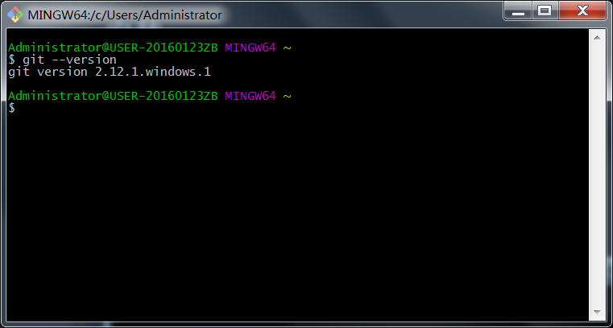

安装完成后，还需要一点设置，在打开的git bash命令行中输入
```
$ git config --global user.name "Your Name"
$ git config --global user.email "email@example.com"
```
**注意把上面改成自己的名字和邮箱地址**

git config命令的--global参数，表示你这台机器上所有的Git仓库都会使用这个配置，

当然也可以对某个仓库指定不同的用户名和Email地址。

因为Git是分布式版本控制系统，所以，每个机器都必须自报家门：你的名字和Email地址。

# 使用github
我们希望项目不只是在本地，只有有网，哪里都可以获取自己的项目，
GitHub 正是这样一个面向开源及私有软件项目的托管平台。
我们可以把自己的项目放在这个平台上，可以和其他人维护项目。

后面会讲git的基本操作，你也可以直接到后面查看。作为一般流程，这里让我们先注册一个github账号

进入[github](https://github.com/)网站,点击sign up


填写信息后点击"create an account" 按钮


之后进入到我们的首页

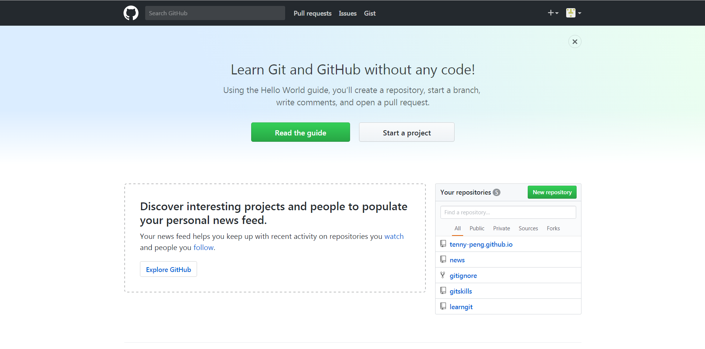

这样我们已经成功拥有了一个github账号，让我们正式开始吧~

简单说下仓库的概念，仓库的英文名是repository，你可以简单理解成一个目录，
这个目录里面的所有文件都可以被Git管理起来，每个文件的修改、删除，Git都能跟踪，
以便任何时刻都可以追踪历史，或者在将来某个时刻可以“还原”。

点击上面的+号，新建一个仓库


输入我们的仓库名称后，点击下面"create repository"按钮即可创建一个仓库
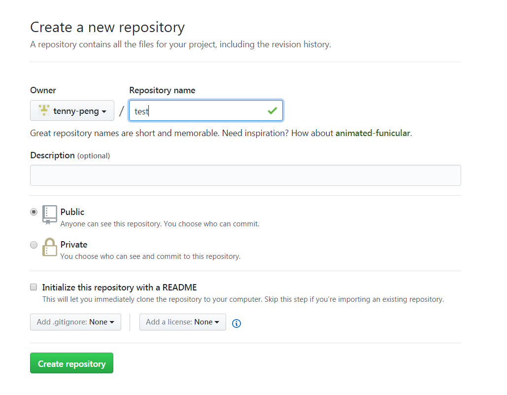

我们可以看到这个仓库是空的，什么都没有。
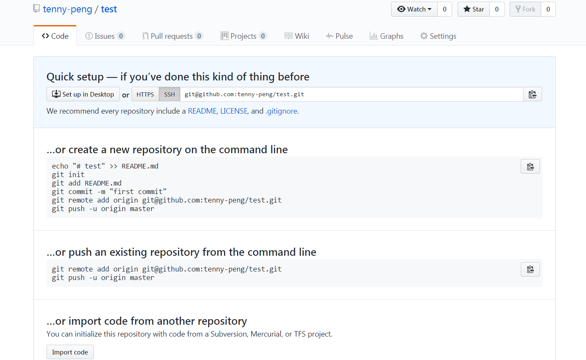

接下来，我们回到本地git上。

# 克隆仓库

由于你的本地Git仓库和GitHub仓库之间的传输是通过SSH加密的，所以还需要一点设置：

回到git bash命令窗口，创建SSH  key:
```
$ ssh-keygen -t rsa -C "youremail@example.com"
```
你需要把邮件地址换成你自己的邮件地址，然后一路回车，使用默认值即可，由于这个Key也不是用于军事目的，所以也无需设置密码。

如果一切顺利的话，可以在用户主目录里找到.ssh目录，里面有id_rsa和id_rsa.pub两个文件，这两个就是SSH Key的秘钥对，id_rsa是私钥，不能泄露出去，id_rsa.pub是公钥，可以放心地告诉任何人。

登录你的github，进入setting，点击"SSH and GPG keys",点击右上角"New SSH Key",tite随便填，Key文本框里粘贴id_rsa.pub文件的内容，最后点击"Add SSh Key"即可。
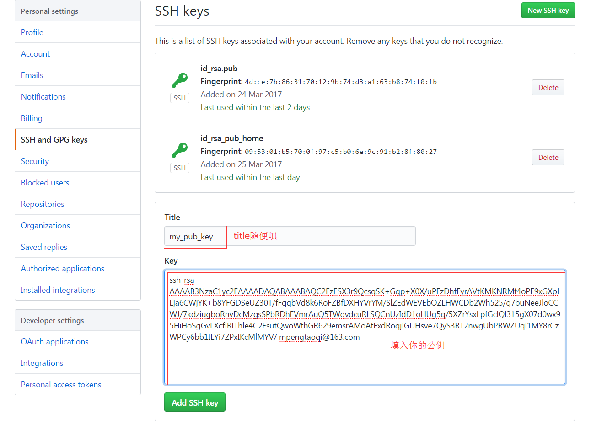

可以看到我这里已经有两个了，一个家里一个公司，这样就可以两边同步信息了。

为什么GitHub需要SSH Key呢？因为GitHub需要识别出你推送的提交确实是你推送的，而不是别人冒充的，而Git支持SSH协议，所以，GitHub只要知道了你的公钥，就可以确认只有你自己才能推送。

接下来输入
```
cd e:
```
切换目录，执行
```
git clone git@github.com:tenny-peng/test.git
```
稍等一会，就可将github上的项目克隆到本地

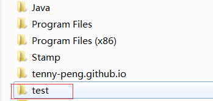

这里我选的e盘根目录，你可以自己修改，**注意：选择的目录下不可以有仓库同名目录**
如我的e盘下不能有test这个目录，不然在克隆时会报错。

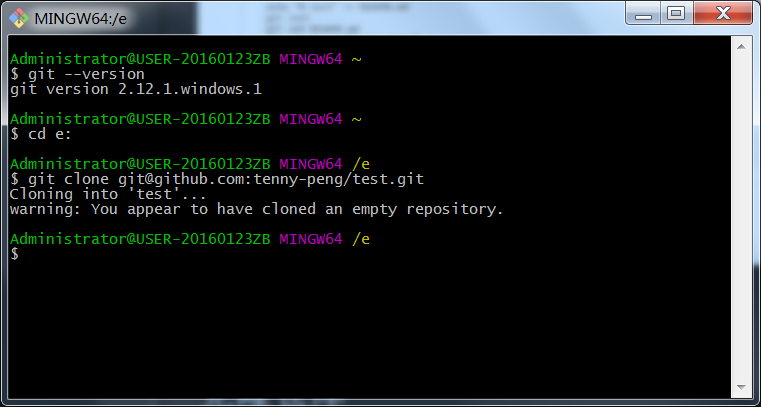
这里有一个警告，说我们的仓库是空的，不用管它，我们马上会添加文件。

# 添加文件

<font color=red size=5>使用Windows的童鞋要特别注意：</font>

千万不要使用Windows自带的记事本编辑任何文本文件。原因是Microsoft开发记事本的团队使用了
一个非常弱智的行为来保存UTF-8编码的文件，他们自作聪明地在每个文件开头添加了0xefbbbf
（十六进制）的字符，你会遇到很多不可思议的问题，比如，网页第一行可能会显示一个“?”，
明明正确的程序一编译就报语法错误，等等，都是由记事本的弱智行为带来的。建议你下载
Notepad++代替记事本，不但功能强大，而且免费！记得把notepad++的默认编码设置为UTF-8
without BOM即可。

在仓库test文件目录下，我们先编写一个readme.txt文件，内容如下：
```
Git is a version control system.
Git is free software.
```
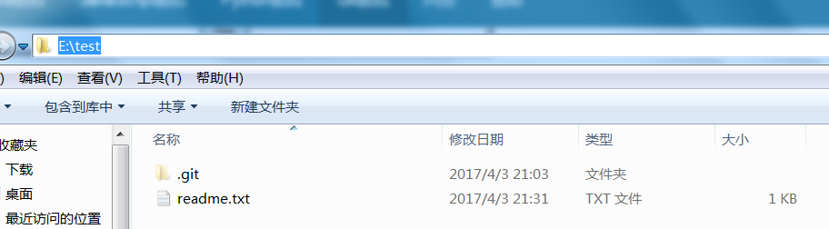

这里我们可以看到test目录下有一个隐藏的.git目录(看不到可自行百度“windows查看隐藏文件方法”)，这个就说明此目录是由git管理的仓库了，如果删除了这个隐藏的目录，那个git也就不认识这个目录了，也不能对此目录下的文件进行管理了。

回到命令行，输入
```
git add readme.txt
```
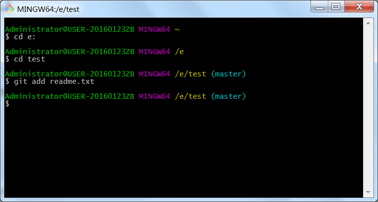

什么反馈信息也没有？那就对了，Unix的哲学是“没有消息就是好消息”，说明添加成功。

使用
```
git status
```
可查看当前仓库状态

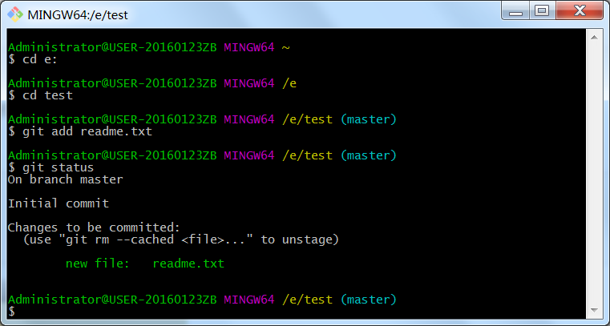

我们发现提示有新文件，但是这样还不够。

我们继续输入
```
git commit -m "add readme.txt"
```
这样才把文件提交到仓库，再次输入"git status"查看状态

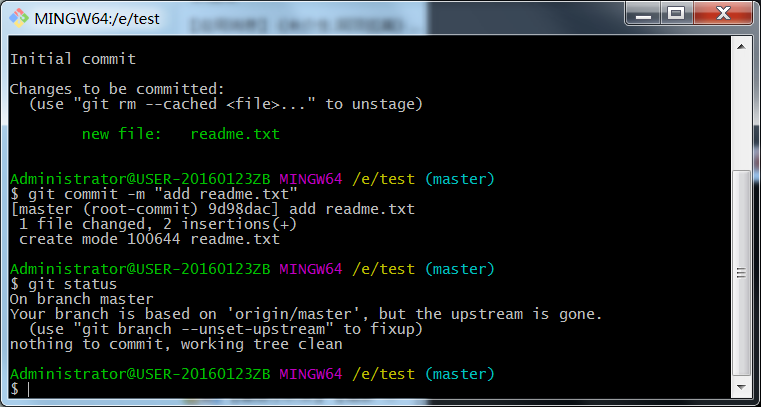

简单解释一下git commit命令，-m后面输入的是本次提交的说明，可以输入任意内容，当然最好是有意义的，这样你就能从历史记录里方便地找到改动记录。

git commit命令执行成功后会告诉你，1个文件被改动（我们新添加的readme.txt文件），插入了两行内容（readme.txt有两行内容）。

# 推送
这里我就在仓库里新增了一个文件，当然还会有修改，删除操作。其实这样就可以管理自己的项目了。但是，我们似乎忘记了github。对，我们需要的是随时随处可获取，所以我们需要把本地仓库的内容同步到github这个托管平台。

当你从远程仓库克隆时，实际上Git自动把本地的master分支(分支后面再讲，简单理解为仓库的多个版本，默认一个主分支)和远程的master分支对应起来了，并且，远程仓库的默认名称是origin。

要查看远程库的信息，输入
```
git remote
```
或
```
git remote -v
```
获取更详细信息

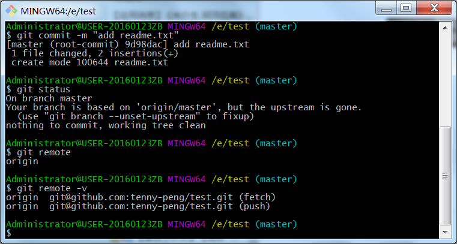

上面显示了可以抓取和推送的origin的地址。如果没有推送权限，就看不到push的地址。

接下来我们把本地改动(这里新增了一个文件，对于git，新增，修改，删除，都属于改动)推送到远程仓库。
```
git push origin master
```
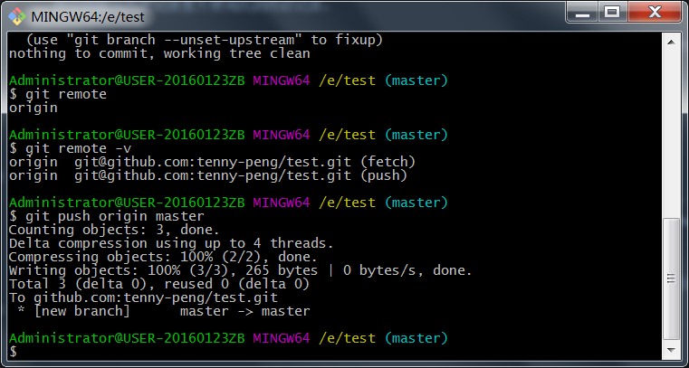

刷新浏览器中我们的github主页，可以看到，readme.txt文件已经同步到远程仓库了。
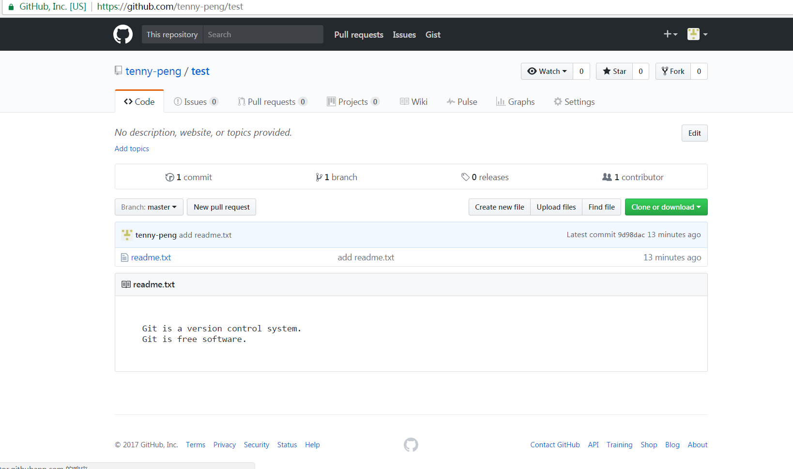

<font size="5">以上我们就使用git创建了自己的仓库，并将其同步到远程服务器上，以便我们在其它地方，或其他人获取。</font>

<br />
参考：

[廖雪峰的git教程](http://www.liaoxuefeng.com/wiki/0013739516305929606dd18361248578c67b8067c8c017b000)

[git互动百科](http://www.baike.com/wiki/GIT)

[github互动百科](http://www.baike.com/wiki/github)
