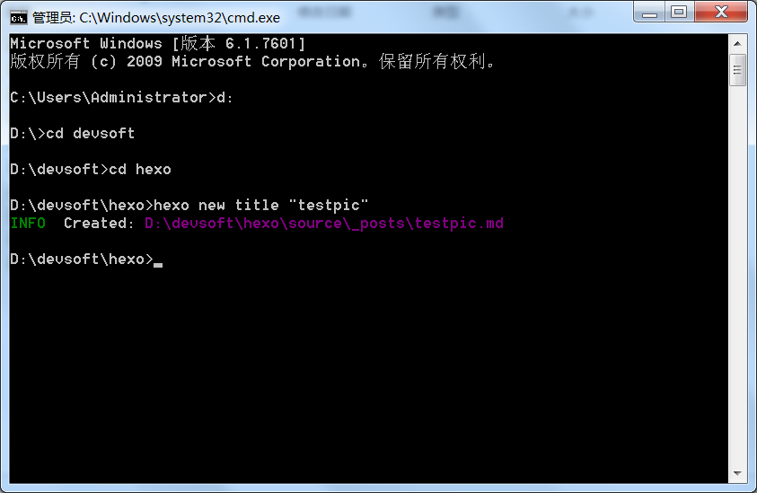
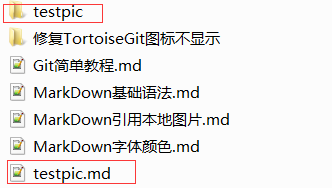
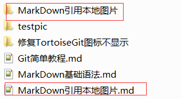
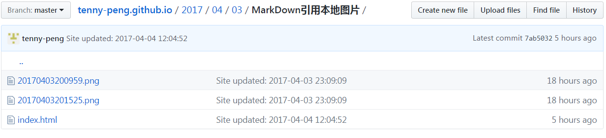

### markdown文章里引用图片有两种方式。

一种是直接引用互联网上的图片，使用绝对路径  http://xxx.com/xxx.jpg

一种是使用本地图片。

因为最后要发布到网上，所以引用本地图片路径必须是相对路径xxx/xxx.png

### 这里讲如何引用本地图片。

首先在站点_config.yml 中找到"post_asset_folder"属性，将其设置为"true"。Hexo 提供了一种更方便管理 Asset 的设定：post_asset_folder。当设置post_asset_folder为true参数后，在建立文件时，Hexo会自动建立一个与文章同名的文件夹，您可以把与该文章相关的所有资源都放到那个文件夹，如此一来，您便可以更方便的使用资源。

启动cmd,切换到hexo的目录下执行
```
npm install https://github.com/CodeFalling/hexo-asset-image --save
```
等待一段时即可。

 安装完成后用hexo新建文章的时候_posts目录下面会多出一个和文章同名的文件夹。图片就可以放在该文件夹下面使用。





把你要引用的图片放在同名目录下,如下引用即可。

```

```

个人感觉也可以不装这个插件，自己手动建立同名文件夹也可以的。但是装了还是方便，毕竟hexo新建文章能初始化一些信息。

再说下本人踩过的坑。在source目录下建立images文件夹存放图片，然后通过../images/xxx.png引用，感觉是没什么问题的，实际在本地也没问题。但是上传到github就不对了。github上去找寻的路径类似
https://tenny-peng.github.io/2017/04/04/images/xxx.png。
很明显这是找不到的，因为发布后2017/04/04下只有文章，没有其他文件或文件夹。也试过在_posts下建立images,通过images/xxx.png引用，结果是一样的。

然后建立了同名文件夹，到github上查看发布后的文件才发现，对于每个md文件，生成一个同名的文件夹，里面有一个index.html文件是md文件转化的内容，我们当初自建的同名文件夹下的图片也在该文件夹下，例如，在github上，对于testpic.md,生成一个testpic文件夹，里面有一个index.html,其内容就是我们得testpic.md里编写的内容，而我们当时正好建立了同名的文件夹来存放图片，此时，这些图片也到了github下的同名文件夹。如此一来，引用就没有问题了。




