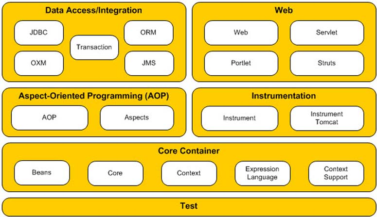
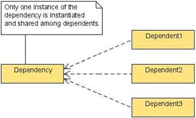
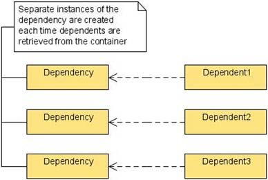

## 1.1 什么是Spring，为什么用Spring？
Spring框架是为了简化企业级Java软件开发而创建的开源应用程序框架。Spring框架给开发人员提供一种组件模型和一套简化且一致的API，使开发人员在创建应用程序时从复杂和易出错的样板代码中脱离出来。

### 1.1.1 Spring框架主要模块
下图展示了Spring的六个基本功能模块【Tip：现在是七大功能模块，书中Spring版本为3.1】


#### Spring核心容器
Spring核心容器提供了从应用程序代码中解耦bean的创建、配置和管理的功能。DI(dependency injection 依赖注入)位于Spring框架的核心，它提供了所有其他模块构建的基本功能。

#### 面向切面编程(aspect-oriented programming AOP)
AOP的目的是将横切关注点(安全、日志、事务管理等)封装成切面，以保持模块化和可重用性。这些关注点往往难以清晰地从系统分离出来，且可能导致代码重复和系统耦合。像DI容器一样，AOP对开发人员独立可用，也用于实现框架的部分功能。例如，事务是横切关注点，Spring通过AOP实现了对声明性事务管理的支持。

#### 数据访问/集成
数据访问/集成模块提供对Java数据库连接(Java Database Connectivity JDBC)API，对象关系映射(object-relational mapping ORM)，对象/XML映射(Object/XML mapping OXM)，Java消息服务(Java Message Service JMS)以及事物(transactional)的支持。

#### Web
Spring的Web模块给集成Web应用，多文件上传，基于网络的远程处理功能提供了通用的基础结构代码。该模块提供了自己的基于servlet/portlet的MVC(Model-View-Controller 模型视图控制器)框架，也集成了其它流行的Web开发框架和技术，如Struts, JSF(JavaServer Faces), Velocity, FreeMarker, JSP(JavaServer Pages)。

##### Instrumentation
该模块提供了一定的应用服务器中使用类工具的支持和类加载器实现。

#### Test
最后是Spring对测试的支持。该模块支持JUnit框架和TestNG框架。

### 1.1.2 为什么使用Spring
除了提供一种组件模型和一套简化且一致的API，还有以下好处：
* 高质量——从模块、包、类结构的总体设计，API的实现以及对源码的测试覆盖率来说，Spring框架是一个高质量开源软件的绝佳例子。
* 模块化——Spring框架已发展到大约有20多个模块，开发人员可以自由选择所需模块而不必引入整个框架。
* 促进最佳实践——基于POJO(plain old Java object)编程模式促进了解耦组件模型、单元测试、及其他最佳实践。
* 适度的学习曲线——得益于API的一致性和简单性，Spring不难学习。而且有海量网络资源，书本知识，以及开发人员经常参与的论坛信息。
* 流行性——众多的出版物、网站和工作职位都证明了Spring框架几乎无处不在。

Spring提供了许多功能，理解和领会它们需要一定时间。但请放心，付出的努力是值得的。学习Spring，使用Spring解决问题，你将明白如何结合不同的技术并将它们集成到内聚的应用程序。你将让硬编码的配置参数远离类并把它们放在一处集中管理。你将设计基于接口的类依赖关系，对不断变化的需求有更好的支持。最终，你将花费更少的工作和时间完成更多任务，因为Spring框架处理外围架构，而你只需专心编写业务代码。

## 1.2 通过依赖注入实现灵活配置
IoC(控制反转)在过去的几年里通过Spring这样的依赖注入容器流行开来。也许在互联网世界它存在已久，但对于许多开发者来说，IoC仍然是一个相对陌生的概念。在这一节里，我们将会解释什么是IoC及其强大的原因。接下来可能要麻烦你动动手，看看怎么配置Spring容器。

### 1.2.1 按原来的方式配置依赖项
```
package com.springinpractice.ch01.dao.jdbc;

import org.apache.commons.dbcp.BasicDataSource;
import com.springinpractice.ch01.dao.AccountDao;

public class JdbcAccountDao implements AccountDao {
    private BasicDataSource dataSource;

    public JdbcAccountDao() {
        dataSource = new BasicDataSource();
        dataSource.setDriverClassName("com.mysql.jdbc.Driver");
        dataSource.setUrl("jdbc:mysql://localhost:3306/springbook" + "?autoReconnect=true");
        dataSource.setUsername("root");
        dataSource.setPassword("");
    }
}
```
在这个例子中，JdbcAccountDao依赖BasicDataSource，而且还需要自己实现dataSource接口实现，设置连接参数。如果dataSource需要在多个Dao之间共享，或者需要切换不同的dataSource，都将引起代码大量重复和改动。

### 1.2.2 依赖注入
```
package com.springinpractice.ch01.dao.jdbc;

import javax.sql.DataSource;
import com.springinpractice.ch01.dao.AccountDao;

public class JdbcAccountDao implements AccountDao {
    private DataSource dataSource;

    public JdbcAccountDao() {}

    public void setDataSource(DataSource dataSource) {
        this.dataSource = dataSource;
    }
}
```
这里JdbcAccountDao不再依赖具体的DataSource，你可以先在某处设置好具体的DataSource实现再将其注入到JdbcAccountDao中（通过set方法）。

### 1.2.3 控制反转
你大可不必手动写依赖注入代码，而将这项工作交由Spring。下面的代码中将有两个依赖注入，一是AccountService依赖于AccountDao，而AccountDao依赖于DataSource。
```
package com.springinpractice.ch01.service;

import com.springinpractice.ch01.dao.AccountDao;

public class AccountService {
    private AccountDao accountDao;

    public AccountService() {}

    public void setAccountDao(AccountDao accountDao) {
        this.accountDao = accountDao;
    }
}
```
那么要怎么指定依赖关系呢，在Spring中我们使用XML来配置它们。
```
<?xml version="1.0" encoding="UTF-8"?>

<beans xmlns="http://www.springframework.org/schema/beans"
      xmlns:xsi="http://www.w3.org/2001/XMLSchema-instance"
      xsi:schemaLocation="http://www.springframework.org/schema/beans
                          http://www.springframework.org/schema/beans/spring-beans-3.1.xsd">
      
      <bean id="dataSource" class="org.apache.commons.dbcp.BasicDataSource" destroy-method="close">
          <property name="driverClassName" value="com.mysql.jdbc.Driver"/>
          <property name="url"
          value="jdbc:mysql://localhost:3306/springbook?autoReconnect=true"/>
          <property name="username" value="someusername"/>
          <property name="password" value="somepassword"/>
      </bean>

      <bean id="accountDao"
          class="com.springinpractice.ch01.dao.jdbc.JdbcAccountDao">
          <property name="dataSource" ref="dataSource"/>
      </bean>

      <bean id="accountService"
          class="com.springinpractice.ch01.service.AccountService">
          <property name="accountDao" ref="accountDao"/>
      </bean>
</beans>
```
1. 声明DataSource对象并配置其参数
2. 声明JdbcAccountDao对象并将DataSource注入
3. 类似2，声明AccountService并将JdbcAccountDao注入

如此一来，服务携带了整体的依赖链，并且对于服务来说配置是完全透明的。

## 1.3 使用XML装配beans
因为Spring框架的其他五个模块功能都建立在核心容器上，所以学习如何装配beans是理解和使用Spring框架最重要的事情。

### 1.3.1 bean的命名空间
bean命名空间是最基本的，用于处理依赖注入，它提供了一种方式来定义beans并连接beans之间的依赖关系。

你可以创建一个XML配置文件来使用bean命名空间。
```
<?xml version="1.0" encoding="UTF-8"?>

<beans xmlns="http://www.springframework.org/schema/beans"
    xmlns:xsi="http://www.w3.org/2001/XMLSchema-instance"
    xsi:schemaLocation="http://www.springframework.org/schema/beans
                        http://www.springframework.org/schema/beans/spring-beans-3.1.xsd">
</beans>
```
上面，我们创建了一个空的配置文件，你可以通过内置的bean元素来定义一个对象。
```
<beans xmlns="http://www.springframework.org/schema/beans"
    xmlns:xsi="http://www.w3.org/2001/XMLSchema-instance"
    xsi:schemaLocation="http://www.springframework.org/schema/beans
                        http://www.springframework.org/schema/beans/spring-beans-3.1.xsd">
    <bean id="accountService"
        class="com.springinpractice.ch01.service.AccountService"/>
</beans>
```
这里你使用bean元素定义了一个AccountService，它有id和class两个属性。id是唯一的，方便我们使用bean；class指定了对象具体的类。

#### 装配beans
你可以使用new关键字来手动创建一个AccountService对象，但是创建服务层对象不会如此简单。服务层对象经常需要依赖DAO，邮件发送接口等。你当然也可以在构造函数里依次初始化这些依赖，但是如果其中一个依赖有所变更，那么一切相关的代码都将重新来过。在Spring，你可以通过setter方法实现这些依赖。
```
<bean id="accountDao"
    class="com.springinpractice.ch01.dao.jdbc.JdbcAccountDao"/>

<bean id="accountService"
    class="com.springinpractice.ch01.service.AccountService">
    <property name="accountDao" ref="accountDao"/>
</bean>
```
上面的配置中，你声明property元素来将accountDao注入到accountService中。property元素有一个name属性，它指明了你想注入的对象属性，然后property元素的ref属性则指明了你想注入的具体bean(通过bean的id)。

其他的服务层或者类也可以依赖于accountDao。如果accountDao的实现变更了，比如从JDBC更改为Hibernate，你只需要更新accountDao的class属性，而不必到各个类去修改依赖于accountDao的代码。

#### 使用PropertyPlaceholderConfigurer配置简单属性
我们的dao需要dataSource，而dataSource各个属性需要初始化。先看看之前的配置：
```
<bean id="dataSource" class="org.apache.commons.dbcp.BasicDataSource"
    destroy-method="close">
    <property name="driverClassName" value="com.mysql.jdbc.Driver"/>
    <property name="url"
    value="jdbc:mysql://localhost:3306/springbook?autoReconnect=true"/>
    <property name="username" value="someusername"/>
    <property name="password" value="somepassword"/>
</bean>

<bean id="accountDao"
    class="com.springinpractice.ch01.dao.jdbc.JdbcAccountDao">
    <property name="dataSource" ref="dataSource"/>
</bean>
```
每个属性都是写死在配置文件中，不利于我们管理。在Spring中，我们可以使用一个API类：PropertyPlaceholderConfigurer来解决这个问题。

首先，我们创建一个properties文件，这里我们命名为springbook.properties。其中内容为：
```
dataSource.driverClassName=com.mysql.jdbc.Driver
dataSource.url=jdbc:mysql://localhost:3306/springbook?autoReconnect=true
dataSource.username=root
dataSource.password=secret
```
然后，我们在配置文件中定义PropertyPlaceholderConfigurer。最后，在定义bean时，使用占位符${}来指定它们的属性值，容器便可以在运行时解析它们。
```
<?xml version="1.0" encoding="UTF-8"?>

<beans xmlns="http://www.springframework.org/schema/beans"
    xmlns:xsi="http://www.w3.org/2001/XMLSchema-instance"
    xsi:schemaLocation="http://www.springframework.org/schema/beans
                        http://www.springframework.org/schema/beans/spring-beans-3.1.xsd">
    
    <bean class="org.springframework.beans.factory.config.PropertyPlaceholderConfigurer">
        <property name="location" value="springbook.properties"/>
    </bean>

    <bean id="accountService"
        class="com.springinpractice.ch01.service.AccountService">
        <property name="accountDao" ref="accountDao"/>
    </bean>

    <bean id="accountDao"
        class="com.springinpractice.ch01.dao.jdbc.JdbcAccountDao">
        <property name="dataSource" ref="dataSource"/>
    </bean>

    <bean id="dataSource"
        class="org.apache.commons.dbcp.BasicDataSource"
        destroy-method="close">
        <property name="driverClassName" value="${dataSource.driverClassName}"/>
        <property name="url" value="${dataSource.url}"/>
        <property name="username" value="${dataSource.username}"/>
        <property name="password" value="${dataSource.password}"/>
    </bean>

</beans>
```
PropertyPlaceholderConfigurer没有id属性。因为Spring容器自动检测它的存在，并启用它的功能。PropertyPlaceholderConfigurer的location属性指定的文件在项目类路径根目录下。在上面的配置中，springbook.properties存在于src/main/resources目录下。你也可以改变文件所在位置：
```
<property name="location" value="file:${user.home}/springbook.properties"/>
```

### 1.3.2 bean的作用域
在使用Spring定义bean时，你可以指定如何从容器中检索并创建实例。这就是bean的作用域。bean的作用域有五个：singleton, prototype, request, session, global session。

作用域是通过scope属性来配置的：
```
<bean id="accountDao"
    class="com.springinpractice.ch01.dao.jdbc.JdbcAccountDao"
    scope="singleton|prototype|request|session|globalSession"/>
```

#### Singleton Scope
Spring中bean的作用域默认为Singleton。当你从Spring容器请求singleton beans时，若这些beans未被创建，Spring将实例化并缓存它们；否则，Spring将从缓存中返回已存在的实例。因此，Spring中的单例bean通常不维护状态，因为它们通常在多个线程之间共享。



#### Prototype Scope
prototype域的beans在每次调用ApplicationContext的getBean()方法被创建，或者每次注入到其他beans中被创建。下面的代码将一个prototype域的bean注入到另一个默认singleton域的bean。
```
<bean id="accountDao"
    class="com.springinpractice.ch01.dao.jdbc.JdbcAccountDao"
    scope="prototype"/>
<bean id="accountService"
    class="com.springinpractice.ch01.service.AccountService">
    <property name="accountDao" ref="accountDao"/>
</bean>
```
在这个情景中，accountService会被创建一次然后缓存起来。在此期间，JdbcAccountDao被创建并注入，但不会被缓存。后续对accountService的请求，无论是通过ApplicationContext的getBean()方法还是注入，将获得唯一的、已缓存的AccountService实例，该实例还带着它的JdbcAccountDao引用。一个singleton引用一个prototype使得这个prototype成为事实上的singleton。但如果你同时将JdbcAccountDao注入到另一个singleton bean中，该singleton bean将持有一个单独实例的引用。



prototype域的bean与singleton域的bean有不同的生命周期。Spring可以管理singleton域beans的完整的生命周期，包括创建和销毁；但是对prototype域的beans只能管理其创建(实例化、配置，通过动态代理装饰)。对于prototype域的beans，需要客户端代码清理释放资源，管理生命周期。在这种情况下，prototype域的beans类似Java关键字new创建的类。

#### Request, Session, 和Global Session Scope
最后三个域——request, session, global session——只在web应用环境中有用。

request域的beans每次来一个HTTP请求都会创建新的实例，类似request域的变量，这些beans可以安全的更改和工作，因为Servlet规范规定每一个HTTP请求有一个单独的线程。

session域的beans局限于标准的session域变量的范围。这些beans和request域的beans一样，也可以安全的修改和工作，因为虽然它们的访问不局限在同一个线程，但是每次都只限一个线程，该线程与客户端请求的当前会话绑定在一起。

global session域的beans只适用于portlet应用程序的上下文中。类似session域的beans，它们存在于整个会话，只不过在web应用中beans在portlets之间是共享的，而session域的beans被每个单独的portlet创建并管理。

## 1.4 使用注解自动装配和组件扫描
使用注解能使我们的XML配置文件更简化。

### 1.4.1 自动装配
在之前我们将dao注入到service配置大致如下：
```
<bean id="accountDao"
    class="com.springinpractice.ch01.dao.jdbc.JdbcAccountDao"/>

<bean id="accountService"
    class="com.springinpractice.ch01.service.AccountService"
    p:accountDao-ref="accountDao"/>
```

当我们使用注解来自动装配时，先在service加入注解@Autowired如下：
```
import org.springframework.beans.factory.annotation.Autowired;

... other imports omitted ...

public class AccountService {

    @Autowired
    private AccountDao accountDao;

    ...
}
```
我们需要修改配置文件来支持注解：
```
<?xml version="1.0" encoding="UTF-8"?>

<beans xmlns="http://www.springframework.org/schema/beans"
    xmlns:xsi="http://www.w3.org/2001/XMLSchema-instance"
    xmlns:p="http://www.springframework.org/schema/p"
    xmlns:context="http://www.springframework.org/schema/context"
    xsi:schemaLocation="
        http://www.springframework.org/schema/beans
        http://www.springframework.org/schema/beans/spring-beans-3.1.xsd
        http://www.springframework.org/schema/context
        http://www.springframework.org/schema/context/spring-context-3.1.xsd
        
        <context:annotation-config/>

        <bean
            class="org.springframework.beans.factory.config.PropertyPlaceholderConfigurer"
            p:location="springbook.properties"/>
        
        <bean
            id="accountService"
            class="com.springinpractice.ch01.service.AccountService"/>
        
        <bean
            id="accountDao"
            class="com.springinpractice.ch01.dao.jdbc.JdbcAccountDao"/>
        
        <bean id="dataSource"
            class="org.apache.commons.dbcp.BasicDataSource"
            destroy-method="close"
            p:driverClassName="${dataSource.driverClassName}"
            p:url="${dataSource.url}"
            p:username="${dataSource.username}"
            p:password="${dataSource.password}"/>
</beans>
```
首先声明context命名空间，它是启动注解的前提。
```
xmlns:context="http://www.springframework.org/schema/context"
```
然后启用注解
```
<context:annotation-config/>
```
然后在service bean定义中不再需要accountDao属性的手动注入。

如果运行该应用程序，Spring会将JdbcAccountDao注入到AccountService中。当一个类字段有@Autowired注解，Spring将在容器中查询类型匹配的bean来注入到这个字段值中。在这个例子中，因为JdbcAccountDao实现了AccountDao接口，而AccountService声明了一个AccountDao字段，Spring将按照类型装配这个依赖。

### 1.4.2 Stereotype注解
虽然我们使用@Autowired注解可以实现自动装配，但我们还是必须在配置文件中定义各个beans。而Spring的Stereotype注解配合组件扫描功能，Spring将自动引入被Stereotype注解的bean到容器中，在XML文件中就不必显示的一个一个定义bean了。

假如你想自动将JdbcAccountDao引入到容器中，那么你只需将@Component注解放在JdbcAccountDao类上：
```
import org.springframework.stereotype.Component;

@Component
public class JdbcAccountDao implements AccountDao {
...
}
```
目前有四个Stereotype注解：@Component, @Repository, @Service, @Controller。
* @Component是通用的注解，被标注的bean会自动引入到依赖注入容器中。
* @Repository是@Component的特定版，它标注一个bean为DAO，将其引入到Spring容器中。它还会将抛出的unchecked exceptions转换为Spring的DataAccessExceptions(同样unchecked)。
*  @Service也是@Component的特定版，它标注一个bean是服务层，虽然没有额外的功能，但使用@Service无疑比@Component更加明确表示bean的作用。
*  @Controller同样是@Component的特定版，标注一个bean是Spring Web MVC controller。

### 1.4.3 组件扫描
就像你声明`context:annotation-config`来开启自动装配，你需要声明`context:component-scan`来自动引入stereotypes注解的类。
```
<?xml version="1.0" encoding="UTF-8"?>

<beans xmlns="http://www.springframework.org/schema/beans"
    xmlns:xsi="http://www.w3.org/2001/XMLSchema-instance"
    xmlns:p="http://www.springframework.org/schema/p"
    xmlns:context="http://www.springframework.org/schema/context"
    xsi:schemaLocation="
        http://www.springframework.org/schema/beans
        http://www.springframework.org/schema/beans/spring-beans-3.1.xsd
        http://www.springframework.org/schema/context
        http://www.springframework.org/schema/context/spring-context-3.1.xsd">

    <context:component-scan base-package="com.springinpractice.ch01"/>

    ...

</beans>
```
` context:component-scan`元素需要` base-package`属性来指定扫描bean组件的位置。在这里我们设定为com.springinpractice.ch01。你也可以设定多个component-scan元素来设定多个bean扫描位置。

另外，当开启`component-scan`时，不必再声明`context:annotation-config`，因为组件扫描已经隐式启用了自动装配。

当在各个类上面标注了各自的Stereotype注解(@Service放在accountService上， @Repository放在accountDao上)后，我们不用再显示定义那么多bean了，配置文件就更加简化了：
```
<?xml version="1.0" encoding="UTF-8"?>

<beans xmlns="http://www.springframework.org/schema/beans"
    xmlns:xsi="http://www.w3.org/2001/XMLSchema-instance"
    xmlns:p="http://www.springframework.org/schema/p"
    xmlns:context="http://www.springframework.org/schema/context"
    xsi:schemaLocation="
        http://www.springframework.org/schema/beans
        http://www.springframework.org/schema/beans/spring-beans-3.1.xsd
        http://www.springframework.org/schema/context
        http://www.springframework.org/schema/context/spring-context-3.1.xsd">

    <context:component-scan base-package="com.springinpractice.ch01"/>

    <bean
        class="org.springframework.beans.factory.config.PropertyPlaceholderConfigurer"
        p:location="springbook.properties"/>

    <bean id="dataSource"
        class="org.apache.commons.dbcp.BasicDataSource"
        destroy-method="close"
        p:driverClassName="${dataSource.driverClassName}"
        p:url="${dataSource.url}"
        p:username="${dataSource.username}"
        p:password="${dataSource.password}"/>

</beans>
```

### 1.4.4 XML和注解，哪个更好？
在大部分情况下，注解更加方便实用，我们一般都会使用注解。

将类配置在XML文件将直观清晰。但是如果一旦这个类需要改动，那么我们可能需要扫描所有和这个类相关的类并做出相应改变，这是很麻烦的。

如果将bean配置为注解，当其需要添加一个字段时，我们只需添加字段，然后所有依赖自动加载即可。如果是XML方式，我们需要打开所有相关配置文件，改变它的字段值，这是很费力的。

当然一些XML配置还是必要的，有些bean来源于外界jar(如dataSource)，需要显示定义，并通过Spring将它们和应用连接起来。

## 总结
本章简要介绍了Spring框架及其主要部分，以及它的基本原理，包括控制反转与依赖注入。通过几个例子，我们演示了使用Spring管理应用程序的依赖关系，并描述如何使用XML和Java注释定义这些依赖。

在下一章中，我们将探索Spring在持久层、对象关系映射和事务管理方面提供的一些非常有用的组件。在许多情况下，您可以以透明的方式将这些组件集成到应用程序中。


