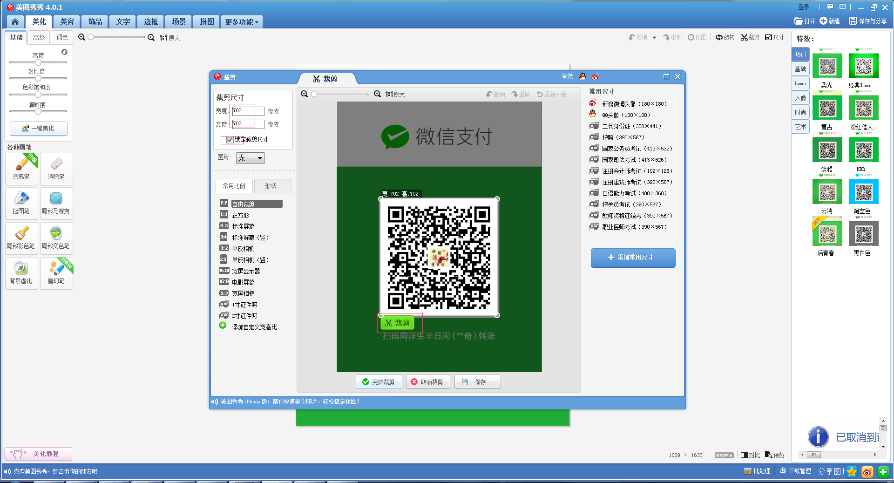
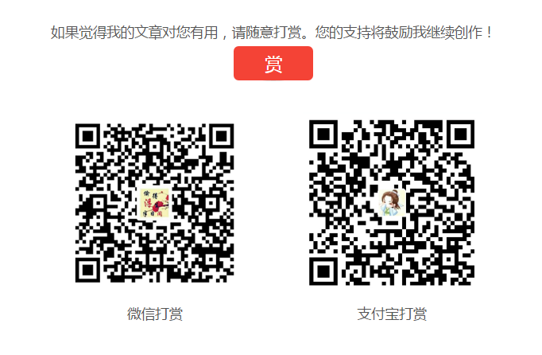

next主题集成了打赏功能，使用起来比较简单。

首先获取微信收款二维码和支付宝收款二维码：

微信：点击右上角的加号"+"，点击"收付款"，点击"我要收款"，就可以看到自己的收款二维码了。还可以点击"设置金额"，之后保存图片(名字可修改为wechatpay.png)。

支付宝： 同理，点击右上角的加号"+"，点击"收钱",出现二维码，也可以设置金额，之后保存图片(名字可修改为ailpay.jpg)。

我们可以在source目录下建立一个images文件夹，将上面保存的图片放入。

微信和支付宝生成的二维码都有外框，不喜欢外框的话可以利用美图秀秀等软件进行剪裁。选定宽度和高度并勾选锁定剪裁尺寸，一般都是剪裁一个正方形，将剪裁框拖到合适地方，点击"剪裁按钮"，再Ctrl + s 保存即可（支付宝图片同理）。


找到主题next下的配置文件_config.yml，添加信息如下：
```
# reward
reward_comment: 如果觉得我的文章对您有用，请随意打赏。您的支持将鼓励我继续创作！
wechatpay: /images/wechatpay.png
alipay: /images/alipay.jpg
```
hexo发布，文章下面就会出现一个赏字，点开效果如下：


以上就成功添加了打赏功能(虽然基本不会有人打赏。。。)
