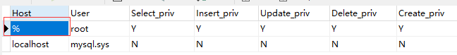

在公司协同开发时，同事需要在局域网内访问我的mysql数据库。但是连接超时，并返回错误代码10060。特此记录一下解决过程。

先找到数据库mysql中的user表，将对应访问的用户的Host由localhost改为%(允许任何IP地址访问)

然后关闭防火墙即可。

但是为了安全着想，不想关闭防火墙，我们可以在防火墙中添加新的规则。

1. 控制面板->系统和安全->防火墙
2. 点击高级设置->入站规则，新建规则，选择端口，下一步
3. TCP 端口，特定本地端口(S)：填写80,3306，下一步
4. 允许连接，下一步
5. 默认全选，下一步
6. 填写配置名称，如"mysql局域网访问策略"，完成。

配置范例见：http://maximumpcguides.com/windows-7/open-a-port-in-windows-7s-firewall/

这样你的同事就可以在局域网内访问你的数据库了。

参考链接：http://www.cnblogs.com/meetweb/p/3701443.html

