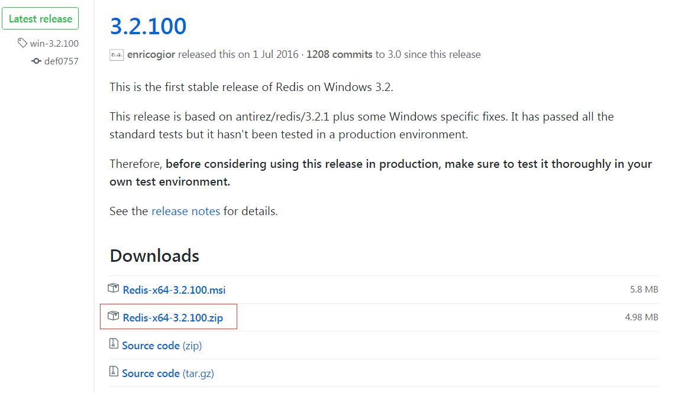
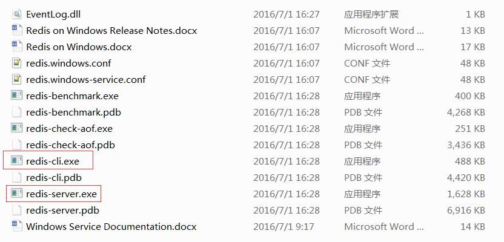
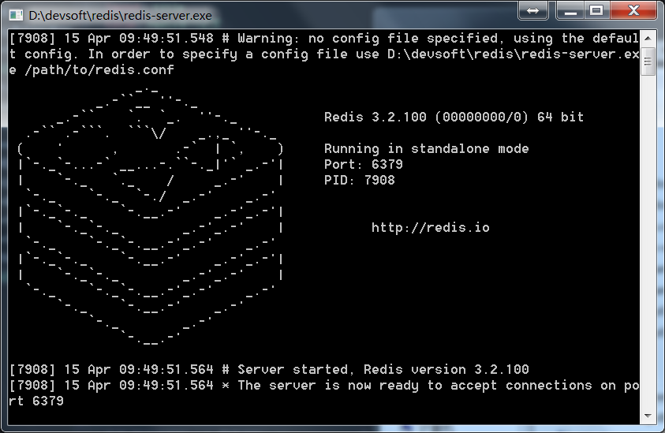
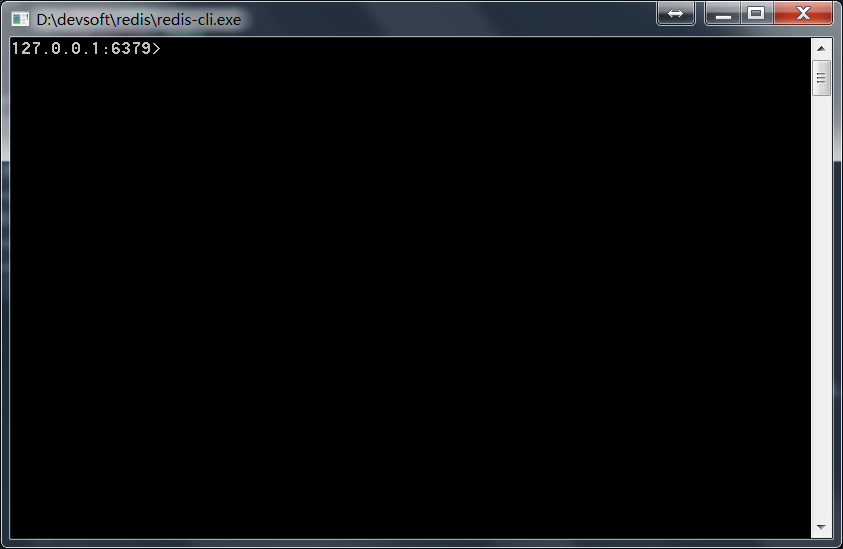
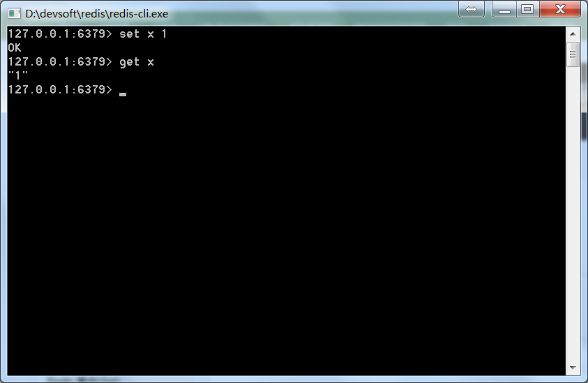

# redis简介

Redis 是一个高性能的key-value数据库。

* Redis可基于内存亦可持久化。
* Redis 支持存储的value类型丰富，包括string(字符串)、list(链表)、set(集合)、zset(sorted set --有序集合)和hash（哈希类型）
* Redis性能极高，读的速度可高达110000次/s，写的速度可高达81000次/s 。
* Redis的所有操作都是原子性的，Redis还支持几个操作合并后的原子性执行。

# Redis 下载安装

Redis官方并不支持Windows。 但是，微软针对Win64自己开发了一个windows版的redis并共享到github上。

点击[https://github.com/MSOpenTech/redis/releases](https://github.com/MSOpenTech/redis/releases)下载。

选择你喜欢的安装方式，这里我选择压缩版。


安装/解压缩后到redis目录找到redis-server.exe和redis-cli.exe


双击redis-server.exe启动redis服务


双击redis-cli.exe启动客户端，用来访问redis服务。


测试一下，设置x的值为1并获取x。


# 使用redis
redis使用key-value来存储数据。

## set & get
使用set命令设置值，并用get命令获取值。
```
> set name "tenny"
OK
> get name
"tenny"
```

## del
del删除一个key
```
> del name
(integer) 1
> get name
(nil)
```

## incr
incr递增一个值，如果key不存在则创造它并初始化值为1
```
> set connections 10
OK
> incr connections
(integer) 11
> incr connections
(integer) 12

> del connections
(integer) 1
> incr connections    //connections不存在，初始化为1
(integer) 1
```

## setnx
setnx(set-if-not-exists)，如果key不存在才改变值。
```
> set name "panda"
OK
> get name
"panda"
> setnx name "tenny"    //因为name存在所以不会改变值
(integer) 0
> get name
"panda"

> get age
(nil)
> setnx age 22    //age不存在，赋值为22
(integer) 1
> get age
"22"
```

## expire & ttl
expire设置生存时间，ttl查看剩余时间。
```
> set name "tenny"
OK
> expire name 120   //设置name生存时间为120秒
(integer) 1
> ttl name
(integer) 80    //剩余80秒
> ttl name      //2分钟后
(integer) -2    //-2表示name这个key已经不存在了。
> get name
(nil)

> set name "tenny"
OK
> ttl name
(integer) -1    //默认-1表示永久存在
> expire name 120
(integer) 1
> ttl name
(integer) 118
> get name
"tenny"
> set name "panda"    //设置值会重置存在时间
OK
> ttl name
(integer) -1
```

## list操作：rpush & lpush & llen & lrange & lpop & rpop

* rpush在list末尾添加元素
```
> rpush color "blue"    //[bule]
(integer) 1
> rpush color "red"   //[bule, red]
(integer) 2
```

* lpush在list开头添加元素
```
> lpush color "yellow"    //[yellow, bule, red]
(integer) 3
```

* llen查看list长度
```
> llen color
(integer) 3
```

* lrange查看list内容，接受两个参数，开始index和结尾index，如果结尾index为-1，表示直到list末尾。
```
> lrange color 0 2
1) "yellow"
2) "blue"
3) "red"
> lrange color 0 1
1) "yellow"
2) "blue"
> lrange color 1 2
1) "blue"
2) "red"
> lrange color 1 2
1) "blue"
2) "red"
```

* lpop移除list第一个元素并返回它
```
> lpop color
"yellow"
> llen color
(integer) 2
> lrange color 0 -1
1) "blue"
2) "red"
```

* rpop移除list最后一个元素并返回它
```
> rpop color
"red"
> llen color
(integer) 1
> lrange color 0 -1
1) "blue"
```

## set操作：sadd & srem & sismember & smembers & sunion
set类似list，但是元素没有顺序且只能出现一次。

* sadd添加一个元素到set
```
> sadd superpowers "flight"   //["flight"]
(integer) 1
> sadd superpowers "x-ray vision"   //["flight", "x-ray vision"]
(integer) 1
> sadd superpowers "reflexes"   //["flight", "x-ray vision", "reflexes"]
(integer) 1
> SADD superpowers "flight"   //重复添加无效
(integer) 0
```

* srem从set中移除一个元素
```
> srem superpowers "reflexes"   //["flight", "x-ray vision"]
1
```

* sismember测试一个元素是否存在于set，存在返回1，不存在返回0
```
> sismember superpowers "flight"
(integer) 1
> sismember superpowers "reflexes"
(integer) 0
```

* smembers查看set所有元素
```
> sismember superpowers
1) "x-ray vision"
2) "flight"
```

* sunion联合多个set并返回它们的合集
```
> sadd birdpowers "pecking"
(integer) 1
> sadd birdpowers "flight"
(integer) 1
> smembers birdpowers
1) "pecking"
2) "flight"
> smembers superpowers
1) "x-ray vision"
2) "flight"
> sunion superpowers birdpowers   //无序的 sunion birdpowers superpowers结果一样
1) "pecking"
2) "flight"
3) "x-ray vision"
```

## sorted set操作：zadd zrange
有序集合(sorted set)类似集合，不过它每个元素有一个关联值，通过这个关联值对元素进行排序。

* zadd为一个有序集合添加元素
```
> zadd hackers 1940 "Alan Kay"
(integer) 1
> zadd hackers 1906 "Grace Hopper"
(integer) 1
> zadd hackers 1953 "Richard Stallman"
(integer) 1
> zadd hackers 1965 "Yukihiro Matsumoto"
(integer) 1
> zadd hackers 1916 "Claude Shannon"
(integer) 1
> zadd hackers 1969 "Linus Torvalds"
(integer) 1
> zadd hackers 1957 "Sophie Wilson"
(integer) 1
> zadd hackers 1912 "Alan Turing"
(integer) 1
```

* zrange类似于lrange，查看sorted set元素。接受两个参数，开始index和结尾index，如果结尾index为-1，表示直到末尾
```
> zrange hackers 0 -1
1) "Grace Hopper"
2) "Alan Turing"
3) "Claude Shannon"
4) "Alan Kay"
5) "Richard Stallman"
6) "Sophie Wilson"
7) "Yukihiro Matsumoto"
8) "Linus Torvalds"
```
可以看到元素以年份递增排序。
```
> ZRANGE hackers 2 4
1) "Claude Shannon"
2) "Alan Kay"
3) "Richard Stallman"
```

## hash操作：hset & hget & hgetall & hmset & hincrby & hdel
 hash 是一个string类型的field和value的映射表，hash特别适合用于存储对象。

 * hset添加值
 ```
> hset user name "tenny"
(integer) 1
> hset user email "tenny@example.com"
(integer) 1
> hset user password "cutepanda"
(integer) 1
```

* hget获取值
```
> hget user name
"tenny"
```

* hgetall获取所有值
```
> hgetall user
1) "name"
2) "tenny"
3) "email"
4) "tenny@example.com"
5) "password"
6) "cutepanda"
```

* hmset一次性设置多个值
```
> hmset user1 name "tenny1" password "cutepanda1" email "tenny1@example.com"
OK
> hgetall user1
1) "name"
2) "tenny1"
3) "password"
4) "cutepanda1"
5) "email"
6) "tenny1@example.com"
```
可以使用hset继续添加或修改
```
> hset user1 age 22
(integer) 1
> hgetall user1
1) "name"
2) "tenny1"
3) "password"
4) "cutepanda1"
5) "email"
6) "tenny1@example.com"
7) "age"
8) "22"
> hset user1 age 24   //已存在的值重复设定返回0，新值返回1
(integer) 0
> hgetall user1
1) "name"
2) "tenny1"
3) "password"
4) "cutepanda1"
5) "email"
6) "tenny1@example.com"
7) "age"
8) "24"
```

* hincrby增加数值型域的值
```
> hset user visits 10
(integer) 1
> hincrby user visits 1
(integer) 11
> hincrby user visits 1
(integer) 12
```

* hdel删除指定的域
```
> hdel user visits
(integer) 1
> hdel user age   //删除不存在的域返回0
(integer) 0
> hdel user visits
(integer) 0
> hincrby user visits 20    //字段不存在则默认设置为0后再执行此增加操作
(integer) 20
```

<font size="5">以上介绍了redis的一些简单命令，可以访问[redis中文官方网站](http://www.redis.cn/commands.html)了解更多。</font>
