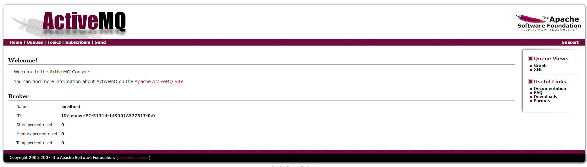
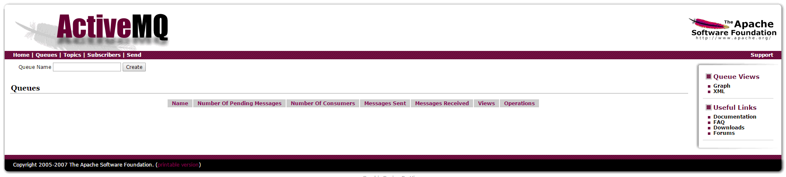
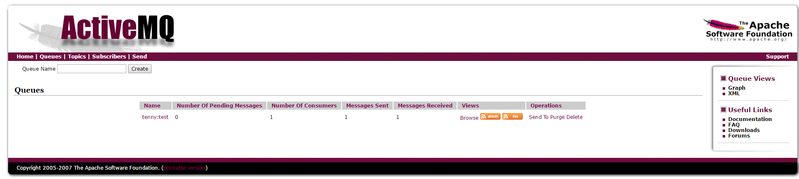
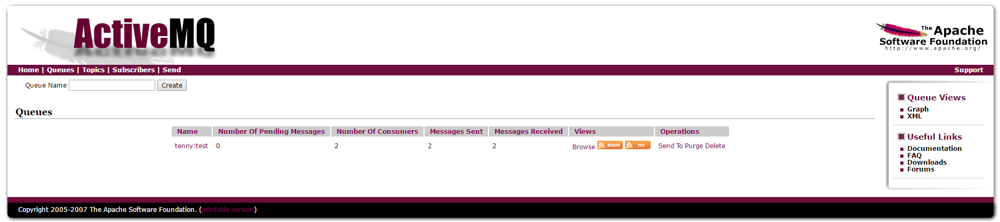
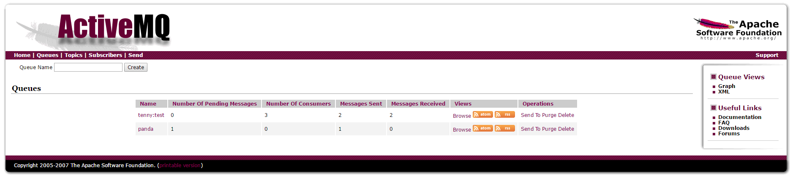
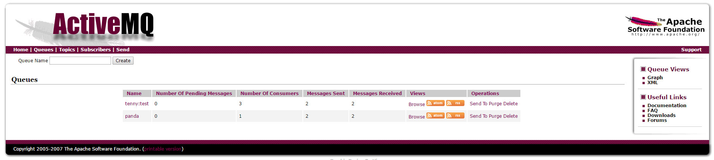

## 1.安装activemq
到http://activemq.apache.org/ 下载最新版。我这里下载的是Windows版。

下载完成之后解压缩，运行bin目录下的activemq.bat，看到类似如下信息说明启动成功。
```
ACTIVEMQ_HOME: D:\devsoft\apache-activemq-5.1.0\bin\..
ACTIVEMQ_BASE: D:\devsoft\apache-activemq-5.1.0\bin\..
Loading message broker from: xbean:activemq.xml
INFO  BrokerService                  - Using Persistence Adapter: AMQPersistenceAdapter(D:\devsoft\apache-activemq-5.1.0\bin\..\data)
INFO  BrokerService                  - ActiveMQ 5.1.0 JMS Message Broker (localhost) is starting
INFO  BrokerService                  - For help or more information please see: http://activemq.apache.org/
INFO  AMQPersistenceAdapter          - AMQStore starting using directory: D:\devsoft\apache-activemq-5.1.0\bin\..\data
INFO  KahaStore                      - Kaha Store using data directory D:\devsoft\apache-activemq-5.1.0\bin\..\data\kr-store\state
INFO  AMQPersistenceAdapter          - Active data files: []
WARN  AMQPersistenceAdapter          - The ReferenceStore is not valid - recovering ...
INFO  KahaStore                      - Kaha Store successfully deleted data directory D:\devsoft\apache-activemq-5.1.0\bin\..\data\kr-store\data
INFO  AMQPersistenceAdapter          - Journal Recovery Started from: DataManager:(data-)
INFO  KahaStore                      - Kaha Store using data directory D:\devsoft\apache-activemq-5.1.0\bin\..\data\kr-store\data
INFO  AMQPersistenceAdapter          - Recovered 3611 operations from redo log in 0.85 seconds.
INFO  AMQPersistenceAdapter          - Finished recovering the ReferenceStore
INFO  TransportServerThreadSupport   - Listening for connections at: tcp://Lenovo-PC:61616
INFO  TransportConnector             - Connector openwire Started
INFO  TransportServerThreadSupport   - Listening for connections at: ssl://Lenovo-PC:61617
INFO  TransportConnector             - Connector ssl Started
INFO  TransportServerThreadSupport   - Listening for connections at: stomp://Lenovo-PC:61613
INFO  TransportConnector             - Connector stomp Started
INFO  TransportServerThreadSupport   - Listening for connections at: xmpp://Lenovo-PC:61222
INFO  TransportConnector             - Connector xmpp Started
INFO  NetworkConnector               - Network Connector default-nc Started
INFO  BrokerService                  - ActiveMQ JMS Message Broker (localhost, ID:Lenovo-PC-51314-1493018577517-0:0) started
INFO  log                            - Logging to org.slf4j.impl.JCLLoggerAdapter(org.mortbay.log) via org.mortbay.log.Slf4jLog
INFO  log                            - jetty-6.1.9
INFO  WebConsoleStarter              - ActiveMQ WebConsole initialized.
INFO  /admin                         - Initializing Spring FrameworkServlet 'dispatcher'
INFO  log                            - ActiveMQ Console at http://0.0.0.0:8161/admin
INFO  log                            - ActiveMQ Web Demos at http://0.0.0.0:8161/demo
INFO  log                            - RESTful file access application at http://0.0.0.0:8161/fileserver
INFO  log                            - Started SelectChannelConnector@0.0.0.0:8161
INFO  FailoverTransport              - Successfully connected to tcp://localhost:61616
INFO  TransportConnector             - Connector vm://localhost Started
```

浏览器输入http://localhost:8161/admin/ 可查看本地activemq运行状态。


点击"Queues"可查看队列情况。现在没有信息，后面测试的时候会有信息。


## 2.Maven添加依赖
```
  <dependency>
    <groupId>org.springframework</groupId>
    <artifactId>spring-jms</artifactId>
    <version>${spring.version}</version>
  </dependency>
  <dependency>  
    <groupId>org.apache.activemq</groupId>  
    <artifactId>activemq-core</artifactId>  
    <version>5.7.0</version>  
  </dependency>
  <dependency>
    <groupId>org.apache.activemq</groupId>
    <artifactId>activemq-pool</artifactId>
    <version>5.7.0</version>
  </dependency>
```

## 3.activemp.properties属性文件
```
# 服务器地址
activemq.brokerURL=tcp://localhost:61616

# 连接池的最大连接数
activemq.maxConnections=10

# 目的队列的名称
activemq.queue.name=tenny:test
```

## 4.spring-activemq.xml配置文件
```
<?xml version="1.0" encoding="UTF-8"?>  
<beans xmlns="http://www.springframework.org/schema/beans"  
    xmlns:xsi="http://www.w3.org/2001/XMLSchema-instance"
    xmlns:context="http://www.springframework.org/schema/context"  
    xmlns:jms="http://www.springframework.org/schema/jms"  
    xsi:schemaLocation="http://www.springframework.org/schema/beans
    					http://www.springframework.org/schema/beans/spring-beans.xsd
						http://www.springframework.org/schema/context
						http://www.springframework.org/schema/context/spring-context.xsd  
						http://www.springframework.org/schema/beans
						http://www.springframework.org/schema/beans/spring-beans.xsd  
						http://www.springframework.org/schema/jms
						http://www.springframework.org/schema/jms/spring-jms.xsd">

    <context:property-placeholder location="classpath:activemq.properties" />

	<!-- 真正可以产生Connection的ConnectionFactory，由对应的 JMS服务厂商提供-->  
	<bean id="targetConnectionFactory" class="org.apache.activemq.ActiveMQConnectionFactory">  
	    <property name="brokerURL" value="${activemq.brokerURL}"/>  
	</bean>

	<bean id="pooledConnectionFactory" class="org.apache.activemq.pool.PooledConnectionFactory" destroy-method="stop">  
	    <property name="connectionFactory" ref="targetConnectionFactory"/>  
	    <property name="maxConnections" value="${activemq.maxConnections}"/>  
	</bean>

	<bean id="connectionFactory" class="org.springframework.jms.connection.SingleConnectionFactory">  
	    <property name="targetConnectionFactory" ref="pooledConnectionFactory"/>  
	</bean>

	<!-- Spring提供的JMS工具类，它可以进行消息发送、接收等 -->  
	<bean id="jmsTemplate" class="org.springframework.jms.core.JmsTemplate">  
	    <property name="connectionFactory" ref="connectionFactory"/>  
	    <property name="defaultDestinationName" value="${activemq.queue.name}"/>  
	</bean>

	<!--队列目的地，点对点模式-->  
	<bean id="queueDestination" class="org.apache.activemq.command.ActiveMQQueue">  
	    <constructor-arg>
	        <value>
	            ${activemq.queue.name}
	        </value>
	    </constructor-arg>  
	</bean>

	<!-- 消息监听器 -->  
	<bean id="activeMQMessageListener" class="com.news.common.activemq.ActiveMQMessageListener" />      

	<!-- 消息监听容器 -->
	<bean id="jmsContainer" class="org.springframework.jms.listener.DefaultMessageListenerContainer">  
	    <property name="connectionFactory" ref="connectionFactory" />  
	    <property name="destination" ref="queueDestination" />  
	    <property name="messageListener" ref="activeMQMessageListener" />  
	</bean>
</beans>
```

其中的ActiveMQMessageListener
```
package com.news.common.activemq;

import javax.jms.JMSException;
import javax.jms.Message;
import javax.jms.MessageListener;
import javax.jms.TextMessage;

/**
 *
 * activemq消息监听
 *
 * @author Tenny.Peng
 */
public class ActiveMQMessageListener implements MessageListener {

	@Override
	public void onMessage(Message message) {
		TextMessage textMsg = (TextMessage) message;
		try {
			// 处理消息
			System.out.println("receive message from " + textMsg.getJMSDestination() + ": " + textMsg.getText());
		} catch (JMSException e) {
			e.printStackTrace();
		}
	}
}
```

## 5.测试类TestActivemq.java
```
package news;

import javax.jms.JMSException;
import javax.jms.Message;
import javax.jms.Session;

import org.springframework.context.support.ClassPathXmlApplicationContext;
import org.springframework.jms.core.JmsTemplate;
import org.springframework.jms.core.MessageCreator;

/**
 * TODO
 *
 * @author tenny.peng
 */
public class TestActivemq {

	public static void main(String[] args) {
		@SuppressWarnings("resource")
		ClassPathXmlApplicationContext context = new ClassPathXmlApplicationContext("spring-activemq.xml");
		JmsTemplate jmsTemplate = (JmsTemplate) context.getBean("jmsTemplate");
		final String destinationName = jmsTemplate.getDefaultDestinationName();
		jmsTemplate.send(destinationName, new MessageCreator() {

			@Override
			public Message createMessage(Session session) throws JMSException {
				// 消息对象
				String message = "some information...";
				return session.createTextMessage(message);
			}
		});
	}

}
```

## 6.测试
运行一次TestActivemq.java，控制台输出如下，监听器已收到消息。
```
receive message from queue://tenny:test: some information...
```
查看Queues界面。没有待处理消息，有1个消费者，已发送/接收了1条信息。


之前的控制台不要关，再运行一次TestActivemq.java，之前的控制台输出如下
```
receive message from queue://tenny:test: some information...
```
说明之前的监听器又收到了消息。

再查看Queues界面。有2个消费者，已发送/接收了2条消息。


还是不关控制台，修改TestActivemq.java中发送消息的destinationName
```
jmsTemplate.send("panda", new MessageCreator()
```
再运行TestActivemq.java，控制台没有任何输出，再查看Queues


可以看到有一条待处理消息，没有消费者，发出1条消息，接收0条消息。

这里tenny:test队列的消费者有3个，因为之前启动的监听器都是针对队列tenny:test的，并没有监听这个新的panda队列。

修改activemq.properties
```
# 目的队列的名称
activemq.queue.name=panda
```
再运行TestActivemq.java，可以看到控制台输出
```
receive message from queue://panda: some information...
receive message from queue://panda: some information...
```
说明这次启动的监听器收到了之前的和当前的消息。

再查看Queues界面，新的队列panda也有一个消费者，发送2条，接收2条(即刚才启动的针对队列panda的监听器接收)。


## 7.总结
* 消息按队列区分(如这里的tenny:test和panda)，每一个队列有生产者(发送消息)和消费者(接收消息)。当没有消费者的时候，生成者的消息就暂时悬挂起来，一旦有消费者空闲，就会接收消息。

* 在测试中，已启动两次TestActivemq.java后，不修改测试代码，继续运行多次TestActivemq.java。可以发现，每次运行后，发送的消息都是由之前的多个监听器随机接收。

* 这里测试直接使用了jmsTemplate，实际应用中，应该写一个service，将jmsTemplate作为私有变量，通过spring注入。然后根据业务封装自己发送的消息。

* 可以为每个业务模块配置单独的activemq.properties，编写对应的生产者service和监听器。每个模块的消息互不干扰。
