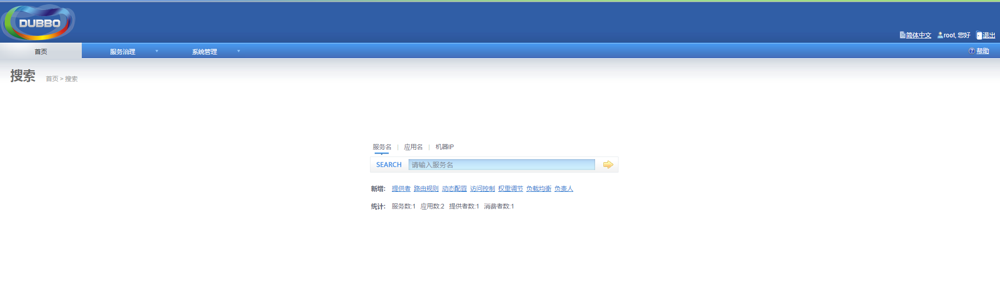
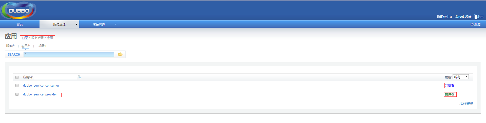
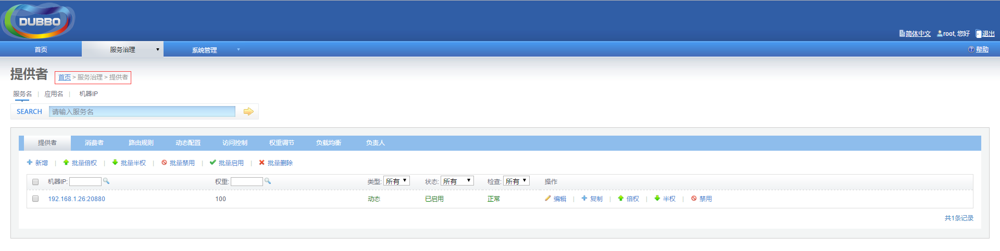
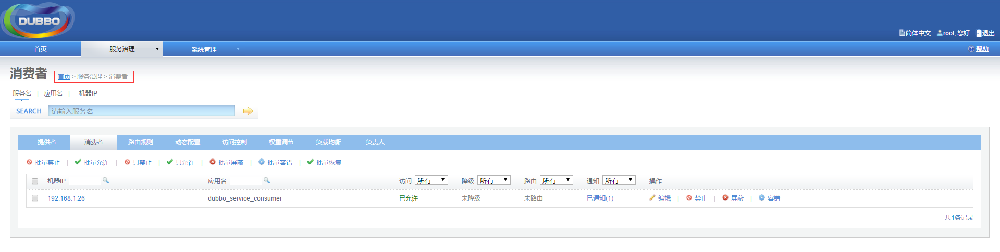
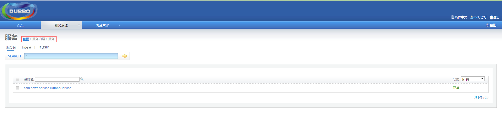

# dubbo是什么
Dubbo是阿里巴巴公司开源的一个高性能优秀的分布式服务框架，致力于提供高性能和透明化的RPC远程服务调用方案，以及SOA服务治理方案。可以和Spring框架无缝集成。

主要核心部件
* 远程通讯：提供对多种基于长连接的NIO框架抽象封装，包括多种线程模型，序列化，以及“请求-响应”模式的信息交换方式。
* 集群容错：提供基于接口方法的透明远程过程调用，包括多协议支持，以及软负载均衡，失败容错，地址路由，动态配置等集群支持。
* 自动发现：基于注册中心目录服务，使服务消费方能动态的查找服务提供方，使地址透明，使服务提供方可以平滑增加或减少机器。

# dubbo能做什么
* 透明化的远程方法调用，就像调用本地方法一样调用远程方法，只需简单配置，没有任何API侵入。
* 软负载均衡及容错机制，可在内网替代F5等硬件负载均衡器，降低成本，减少单点。
* 服务自动注册与发现，不再需要写死服务提供方地址，注册中心基于接口名查询服务提供者的IP地址，并且能够平滑添加或删除服务提供者。

# dubbo的架构


节点角色说明：
* Provider：暴露服务方称之为“服务提供者”。
* Consumer：调用远程服务方称之为“服务消费者”。
* Registry：服务注册与发现的中心目录服务称之为“服务注册中心”。
* Monitor：统计服务的调用次数和调用时间的日志服务称之为“服务监控中心”。
* Container：服务运行容器。

调用关系说明：
0. 服务容器负责启动，加载，运行服务提供者。

1. 服务提供者在启动时，向注册中心注册自己提供的服务。

2. 服务消费者在启动时，向注册中心订阅自己所需的服务。

3. 注册中心返回服务提供者地址列表给消费者，如果有变更，注册中心将基于长连接推送变更数据给消费者。

4. 服务消费者，从提供者地址列表中，基于软负载均衡算法，选一台提供者进行调用，如果调用失败，再选另一台调用。

5. 服务消费者和提供者，在内存中累计调用次数和调用时间，定时每分钟发送一次统计数据到监控中心。

# spring集成使用
Dubbo采用全Spring配置方式，透明化接入应用，对应用没有任何API侵入，只需用Spring加载Dubbo的配置即可，Dubbo基于Spring的Schema扩展进行加载。

##  下载zookeeper
zookeeper是一个分布式服务框架，本例使用zookeeper管理dubbo服务。下载地址：http://www.apache.org/dyn/closer.cgi/zookeeper/  下载后解压即可，进
入zookeeper根目录下的bin目录，如D:\devsoft\zookeeper-3.4.8\bin，双击zkServer.cmd启动注册中心服务。

## 服务提供者
新建一个maven工程，作为服务提供方。

### pom.xml
除了基本的spring等依赖，额外添加dubbo和zkclient依赖：
```
<!-- spring dubbo 整合 -->
<dependency>
    <groupId>com.alibaba</groupId>
    <artifactId>dubbo</artifactId>
    <version>2.5.3</version>
</dependency>

<!-- dubbo注册在zookeeper上，必须引用zkclient -->
<dependency>
    <groupId>com.github.sgroschupf</groupId>
    <artifactId>zkclient</artifactId>
    <version>0.1</version>
</dependency>
```

### spring-dubbo.xml
```
<?xml version="1.0" encoding="UTF-8"?>
<beans xmlns="http://www.springframework.org/schema/beans"
	xmlns:xsi="http://www.w3.org/2001/XMLSchema-instance"
   	xmlns:dubbo="http://code.alibabatech.com/schema/dubbo"
   	xsi:schemaLocation="http://www.springframework.org/schema/beans
						http://www.springframework.org/schema/beans/spring-beans.xsd
				       	http://code.alibabatech.com/schema/dubbo
				       	http://code.alibabatech.com/schema/dubbo/dubbo.xsd">

    <!-- 提供方应用信息，用于计算依赖关系 -->
    <dubbo:application name="dubbo_service_provider" />

    <!--使用zookeeper注册中心暴露和发现服务地址 -->
    <dubbo:registry address="zookeeper://127.0.0.1:2181" />

    <!-- 用dubbo协议在20880端口暴露服务 -->  
    <dubbo:protocol name="dubbo" port="20880" />

    <!-- 声明需要暴露的服务接口 -->  
    <dubbo:service interface="com.news.service.IDubboService" ref="dubboService" />

    <!-- 具体的实现bean -->  
    <bean id="dubboService" class="com.news.service.impl.DubboServiceImpl" />

</beans>
```

### IDubboService & DubboServiceImpl
```
package com.news.service;

/**
 * TODO
 *
 * @author tenny.peng
 */
public interface IDubboService {
	public void sayHello(String name);
}
```
```
package com.news.service.impl;

import com.news.service.IDubboService;

/**
 * TODO
 *
 * @author tenny.peng
 */
public class DubboServiceImpl implements IDubboService {

	@Override
	public void sayHello(String name) {
		System.out.println("hello: " + name);
	}

}
```

### TestDubbo.java
```
package news;

import java.io.IOException;

import org.springframework.context.support.ClassPathXmlApplicationContext;

/**
 * TODO
 *
 * @author tenny.peng
 */
public class TestDubbo {

	public static void main(String[] args) throws IOException {
		ClassPathXmlApplicationContext context = new ClassPathXmlApplicationContext("dubbo/spring-dubbo.xml");

		System.in.read(); // 为保证服务一直开着，利用输入流的阻塞来模拟
	}

}
```
运行TestDubbo.java，我们的服务提供方就完成了。

## 服务消费者
再新建一个maven工程，作为服务消费者。

### pom.xml
消费者引入之前服务提供者的服务(这里引用了整个项目，实际中项目会分层，只需引用对应的service层即可)。
```
<dependency>
  <groupId>org.news</groupId>
  <artifactId>news</artifactId>
  <version>${news.version}</version>
</dependency>
```
服务提供者对应的工程信息：
```
<groupId>org.news</groupId>
<artifactId>news</artifactId>
<packaging>war</packaging>
<version>0.0.1</version>
```

### spring-dubbo.xml
```
<?xml version="1.0" encoding="UTF-8"?>
<beans xmlns="http://www.springframework.org/schema/beans"
	xmlns:xsi="http://www.w3.org/2001/XMLSchema-instance"
   	xmlns:dubbo="http://code.alibabatech.com/schema/dubbo"
   	xsi:schemaLocation="http://www.springframework.org/schema/beans
						http://www.springframework.org/schema/beans/spring-beans.xsd
				       	http://code.alibabatech.com/schema/dubbo
				       	http://code.alibabatech.com/schema/dubbo/dubbo.xsd">

    <!-- 消费方应用名，用于计算依赖关系，不是匹配条件，不要与提供方一样 -->
    <dubbo:application name="dubbo_service_consumer" />

    <!--使用zookeeper注册中心暴露和发现服务地址 -->
    <dubbo:registry protocol="zookeeper" address="127.0.0.1:2181" />

    <!-- 生成远程服务代理，可以像使用本地bean一样使用userService -->  
    <dubbo:reference id="dubboService" interface="com.news.service.IDubboService"/>

</beans>
```
这里的"dubbo:application name"虽然说名字不要一样，实际测试一样也没啥问题。。。

### TestDubbo.java
```
package test;

import java.io.IOException;

import org.springframework.context.support.ClassPathXmlApplicationContext;

import com.news.service.IDubboService;

/**
 * TODO
 *
 * @author tenny.peng
 */
public class TestDubbo {

	public static void main(String[] args) throws IOException {
		ClassPathXmlApplicationContext context = new ClassPathXmlApplicationContext("spring-dubbo.xml");
		IDubboService dubboService = (IDubboService) context.getBean("dubboService");
		dubboService.sayHello("dubbo");
	}

}
```
运行TestDubbo.java，可以发现服务提供方的控制台输出
```
hello: dubbo
```
说明服务已经被调用成功了。

# dubbo管理页面
网上搜索dubbo控制台页面，下载dubbo-admin.war。
自己下载的地址：http://www.pc6.com/softview/SoftView_468561.html

### 使用方法
先把tomcat下的webapps\ROOT目录下内容清空，将war包解压，解压的内容放进ROOT目录下。进入tomcat下的bin目录，运行startup.bat。

运行如果出现类似如下错误
```
Caused by: org.springframework.beans.NotWritablePropertyException: Invalid property 'URIType' of bean class [com.alibaba.citrus.service.uribroker.uri.GenericURIBroker]: Bean property 'URIType' is not writable or has an invalid setter method. Does the parameter type of the setter match the return type of the getter?
```
因为使用的jdk版本为1.8，不支持dubbo-admin中编写的方法。参考：http://blog.csdn.net/liutengteng130/article/details/47112683

解决办法可以降低jdk版本到1.7，但是项目都用了1.8，不想单独为它改环境变量。另一个办法是：
找到tomcat/bin目录中的setclasspath.bat，修改setclasspath.bat文件：
```
if ""%1"" == ""debug"" goto needJavaHome

set JAVA_HOME=D:\devsoft\Java\jdk1.7.0_71

rem Otherwise either JRE or JDK are fine
if not "%JRE_HOME%" == "" goto gotJreHome
if not "%JAVA_HOME%" == "" goto gotJavaHome
echo Neither the JAVA_HOME nor the JRE_HOME environment variable is defined
echo At least one of these environment variable is needed to run this program
goto exit
```
在合适位置加上这一行：set JAVA_HOME=D:\devsoft\Java\jdk1.7.0_71

### 查看页面
启动成功后，浏览器输入http://localhost:8080/ 就可以访问了。

第一次进入要求输入账号密码，默认root/root。
* 管理页面


* 应用页面


* 提供者页面


* 消费者页面


* 服务页面


参考博客：http://www.cnblogs.com/Javame/p/3632473.html
