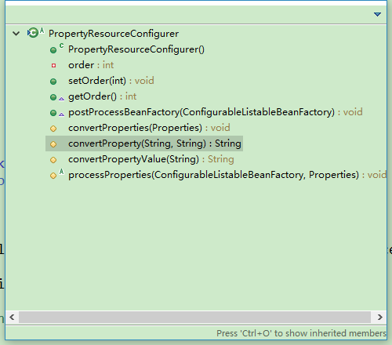
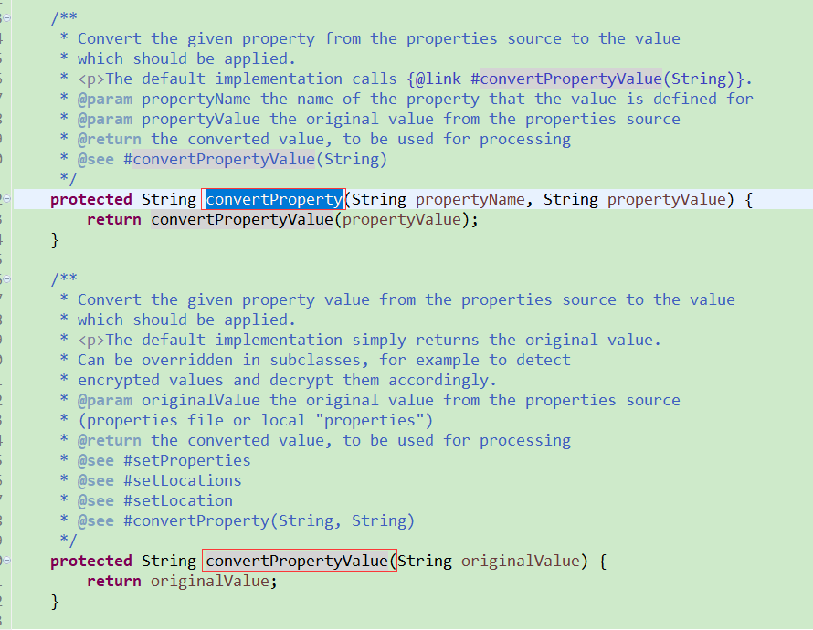
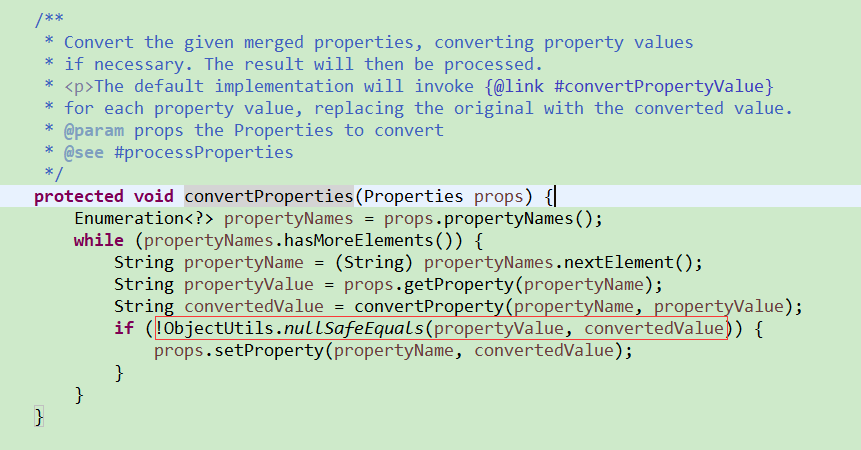
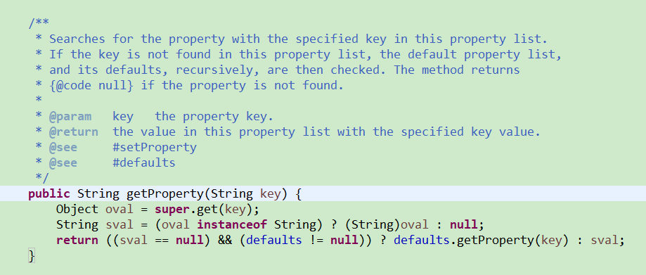

## 前言
出于安全考虑，项目的properties文件中某些属性需要加密存放，使用时解密。

### 解决方案1.0
首先我们自定义一个属性加载器，继承自spring的PropertyPlaceholderConfigurer。
```
/**
 * 解密自定义加密属性
 *
 * @author tenny
 *
 */
public class EncryptPropertyPlaceholderConfigurer extends PropertyPlaceholderConfigurer {

    private List<String> encryptPropNames;

    // 覆写转换方法，对自定义属性解密
    @Override
    protected String convertProperty(String propertyName, String propertyValue) {

        if (encryptPropNames.contains(propertyName)) {
            return AESUtil.decrypt(propertyValue);
        }
        return propertyValue;
    }

    public void setEncryptPropNames(List<String> encryptPropNames) {
        this.encryptPropNames = encryptPropNames;
    }

}
```

然后修改配置文件如下：
```
<!-- 自定义属性加载器，解密某些属性 -->
    <bean id="placeholderConfig" class="com.tenny.common.EncryptPropertyPlaceholderConfigurer">
        <!-- 配置需解密的属性 -->
        <property name="encryptPropNames">
           <list>
               <value>jdbc.password</value>
               <value>redis.password</value>
           </list>
        </property>
        <property name="locations">
            <list>
                <value>classpath:conf/jdbc.properties</value>
                <value>classpath:conf/redis.properties</value>
            </list>
        </property>
    </bean>
```

其中jdbc.properties中password属性加密存储
```
jdbc.driver=com.mysql.jdbc.Driver
jdbc.url=jdbc:mysql://localhost:3306/news
jdbc.username=root
jdbc.password=3hj83jsf234hp3jd
#定义初始连接数  
jdbc.initialSize=0
#定义最大连接数  
jdbc.maxActive=20
#定义最大空闲  
jdbc.maxIdle=20
#定义最小空闲  
jdbc.minIdle=1
#定义最长等待时间  
jdbc.maxWait=60000
```
redis.properties同样
```
# Redis settings
redis.host=localhost
redis.port=6379
redis.pass=4jd89jkn68943gf1
redis.maxTotal=200
redis.maxIdle=50
redis.minIdle=300
redis.maxWaitMillis=1000
redis.testOnBorrow=true
```

至于加密解密工具AESUtil网上很多，这里就不贴了。

项目启动时，由于覆写了convertProperty方法，而每个属性都会过一遍该方法，通过配置encryptPropNames的值，就可以灵活选择需要解密的字段了。

### 新的问题
按理说到这里就满足需求了，然而tenny又遇到了一个问题。我们知道，加密解密工具AESUtil是需要key的，如果这个key也存在properties文件中呢。按上述方法，假如先读取到key再读取properties文件加密属性，是可以正常解析的。但假如先读取到需要解密的属性，这时候AESUtil所需key还是空，就会造成解密错误了。

由于properties继承自Hashtable，key/value不保证进出顺序，故加载properties属性顺序不保证与文件所写一致，所以想通过把key属性写在最前面来解决是不行的。

有一个解决方案是自定义一个OrderedProperties类继承自Properties，然后使用这个OrderedProperties来存放属性，保证读取顺序与写入顺序一致即可。我这里使用的是另外一种办法。

### 回顾之前方案
一路查看PropertyPlaceholderConfigurer继承链到PropertyResourceConfigurer，查看所有方法


查看原convertProperty(String, String)方法，可以看到原方法只是将值原样返回了。


那么为什么覆写convertProperty方法改写了值后就能得到改变后的值呢，我们再看convertProperties(Properties)方法


也就是说先获取值，再经convertProperty方法获取另一个值，如果两者不同则以后者为准。所以我们之前覆写convertProperty(String, String)方法就可以自定义解密属性值了。

再回到新的问题上，properties属性解密需要AESUtil，而AESUtil先需要key属性，怎么解决这个"死锁"问题呢。

### 解决方案2.0
看了上面的源码我们自然就想到了另一个办法，就是覆写convertProperties(Properties)方法。
```
/**
 * 解密自定义加密属性
 *
 * @author tenny
 *
 */
public class EncryptPropertyPlaceholderConfigurer extends PropertyPlaceholderConfigurer {

    private List<String> encryptPropNames;

    @Override
    protected void convertProperties(Properties props) {
        // 1.找到key属性值以初始化AESUtil
        AESUtil.key = props.getProperty("key");
        // 2.回调原遍历方法
        super.convertProperties(props);
    }

    // 3.覆写转换方法，对自定义属性解密
    @Override
    protected String convertProperty(String propertyName, String propertyValue) {

        if (encryptPropNames.contains(propertyName)) {
            return AESUtil.decrypt(propertyValue);
        }
        return propertyValue;
    }

    public void setEncryptPropNames(List<String> encryptPropNames) {
        this.encryptPropNames = encryptPropNames;
    }

}
```
其中的props.getProperty(String)方法可以根据键直接获取对应值


核心思路还是先拿到key，再处理其他属性。如此一来，就解决了解密属性要AESUtil而AESUtil要key属性的"死锁"问题。

### 总结
一般来说，大部分情况下解决方案1.0足矣。

不过我这里比较特别一点，场景稍微有点麻烦。先是折腾了半天想办法如何按写入顺序读出属性，但是感觉把事情搞得更麻烦了，又得引入新的东西，最后还是放弃了这种方案。后来在上级老大的提示下尝试重写convertProperty更上层的convertProperties方法，结合Properties.getProperty(String key)方法，对数据有了更灵活的控制，问题也就解决了。
