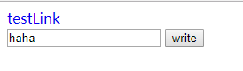
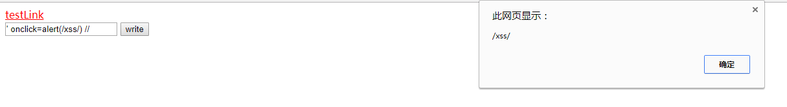
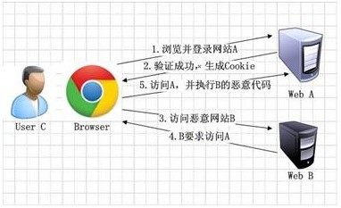
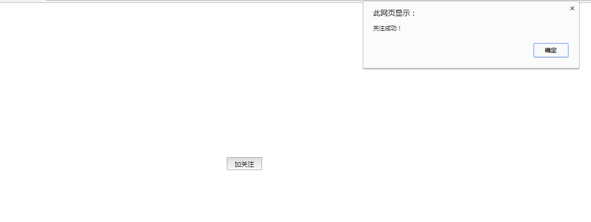
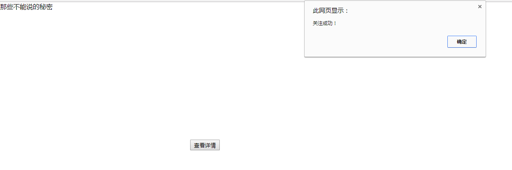
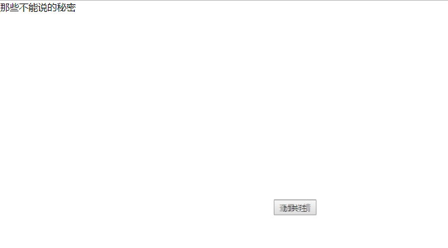
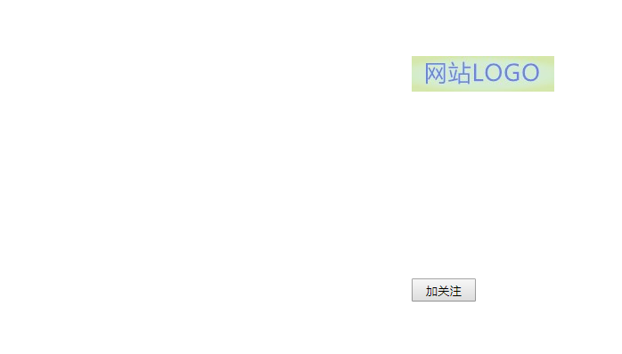
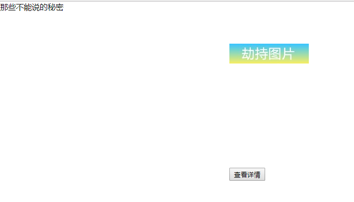
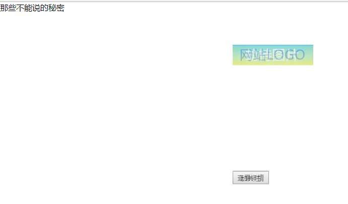

最近项目涉及到安全方面，自己特意了解了一下，记录在此，共同学习。

常见的web安全有以下几个方面
* 同源策略（Same Origin Policy）
* 跨站脚本攻击XSS（Cross Site Scripting）
* 跨站请求伪造CSRF（Cross-site Request Forgery）
* 点击劫持（Click Jacking）
* SQL注入（SQL Injection）

# 同源策略

## 含义
所谓同源策略，指的是浏览器对不同源的脚本或者文本的访问方式进行的限制。比如源a的js不能读取或设置引入的源b的元素属性。

所谓"同源"指的是"三个相同"
* 协议相同
* 域名相同
* 端口相同

举例来说，http://www.example.com/dir/page.html 这个网址，协议是 http:// ，域名是 www.example.com ，端口是 80（默认端口可以省略）。它的同源情况如下
```
http://www.example.com/dir2/other.html：同源
http://example.com/dir/other.html：不同源（域名不同）
http://v2.www.example.com/dir/other.html：不同源（域名不同）
http://www.example.com:81/dir/other.html：不同源（端口不同）
```

## 目的
同源政策的目的，是为了保证用户信息的安全，防止恶意的网站窃取数据。

设想这样一种情况：A网站是一家银行，用户登录以后，又去浏览其他网站。如果其他网站可以读取A网站的 Cookie，Cookie 包含的信息（比如存款总额）就会泄漏。而Cookie 往往用来保存用户的登录状态，如果用户没有退出登录，其他网站就可以冒充用户，为所欲为。

由此可见，"同源政策"是必需的，否则 Cookie 可以共享，互联网就毫无安全可言了。

## 限制
随着互联网的发展，"同源政策"越来越严格。目前，如果非同源，共有三种行为受到限制
* Cookie、LocalStorage 和 IndexDB 无法读取
* DOM 无法获得
* AJAX 请求不能发送

## Ajax应用
我们可以在本地模拟非同源的ajax请求。

先写一个简单的web应用作为服务方，提供一个登陆服务接口，部署运行在tomcat上，此tomcat端口为8080。

再写一个小工程，只有一个简单的登陆页面。部署在另一个tomcat上，此tomcat端口设定为8081。

如此一来，两个工程就不是同源了，因为端口不同。我们在登陆页面发送ajax请求，出现错误：
```
XMLHttpRequest cannot load http://192.168.2.82:8080/Demo/user/login. No 'Access-Control-Allow-Origin' header is present on the requested resource. Origin 'http://localhost:8081' is therefore not allowed access. The response had HTTP status code 403.
```

要解决这个问题，可以在服务器方设定
```
response.setHeader("Access-Control-Allow-Origin", "*");
```
服务方就可以允许其他域名访问。

要设定允许某个域名或某几个域名如下
```
response.setHeader("Access-Control-Allow-Origin", "http://localhost:8081");

response.setHeader("Access-Control-Allow-Origin", "http://localhost:8081,http://localhost:8082");
```

在spring mvc中，有一个注解@CrossOrigin，在需要提供跨域访问的方法上添加即可
```
@CrossOrigin(origins = {"http://localhost:8081", "http://192.168.2.99:8080"})
```

这样就可以成功跨域登陆了。

实际应用中，也可以让ajax访问同源服务接口，再由此服务去访问其他服务。

# 跨站脚本攻击

## 简介
跨站脚本攻击(Cross Site Scripting),为了不和层叠样式表（Cascading Style Sheets,CSS）缩写混淆，所以在安全领域叫做XSS。

XSS攻击，是指黑客通过"HTML注入"篡改了网页，插入了恶意的脚本，在用户浏览网页时，代码执行，从而实现用户浏览器。对受害用户可能采取Cookie资料窃取、会话劫持、钓鱼欺骗等各种攻击。

XSS有如下几种类型

1. 反射型XSS

	反射型XSS只是简单地把用户输入的数据"反射"给浏览器。也就是说，黑客需要诱使用户点击一个恶意链接，才能攻击成功。反射型XSS也叫非持久型XSS。

	比如
    ```
    <div>${message}</div>
    ```
    正常情况用户提交信息
    ```
    http://xxx.com/test.html?param=hello
    ```
    那么浏览器正常输出"hello"信息

    但是如果用户输入了一段HTML代码
    ```
    http://xxx.com/test.html?param=<script>alert("xss")</script>
    ```
    那么页面弹框，显示"XSS"

2. 存储型XSS

	存储型XSS会把用户输入的数据"存储"在服务器。这种XSS具有很强的稳定性。

    比较常见的场景是，黑客写了一遍包含有恶意JavaScript的博客文章，文章发表后，所有访问该博客文章的用户，都会在他们的浏览器中执行这段恶意的JavaScript代码。黑客把恶意脚本保存到服务器端，所以这种XSS攻击就叫做"存储型XSS"。

3. DOM Based XSS

	通过修改页面的DOM节点形成的XSS称之为DOM Based XSS。实际上，这种类型的XSS并非按照"数据是否保存在服务器端"来划分，DOM Based XSS从效果上来说也是反射型XSS。

    假设xss.html页面代码如下
    ```
    <!DOCTYPE HTML>
    <html>
        <head>
            <title>xss</title>
            <meta http-equiv="Content-Type" content="text/html; charset=utf-8" />
        </head>
        <body>
            <div id="t"></div>
            <input type="text" id="text" value="" />
            <input type="button" id="s" value="write" onclick="test()" />
        </body>

        <script>
            function test(){
                var str = document.getElementById("text").value;
                document.getElementById("t").innerHTML = "<a href='" + str + "'>testLink</a>";
            }
        </script>

    </html>
    ```
    文本框输入内容并点击write按钮后，会在当前页面插入一个超链接，其地址为输入的内容。
    
    假设用户输入为
    ```
    ' onclick=alert(/xss/) //
    ```
    那么页面代码变为
    ```
    <a href'' onclick=alert(/xss/)//'>testLink</a>
    ```
    首先用第一个单引号闭合掉href的第一个单引号，然后插入一个onclick事件，最后在用//注释掉第二个单引号。
    
    点击链接，脚本执行
    
    

## 防御
XSS攻击成功的根本原因是将输入的数据当成了代码来执行，从而违背了原来的语义。所以要在输入的时候要严格过滤，输出的时候也要进行检查。

### 输入检查
常见的XSS攻击，SQL注入，都要求攻击者构造一些特殊字符，这些特殊字符是正常用户不会用到的，所以输入检查很有必要。

只接受指定长度范围和期望格式的的内容提交，阻止或者忽略除此外的其他任何数据。比如：用户名只能是字母加数字，手机不长于16位，且大陆手机必须以13x，15x开头，否则非法。过滤一些些常见的敏感字符，例如：
```
< > ‘ “ & # \ javascript expression  "onclick="  "onfocus"
```
过滤或移除特殊的Html标签， 例如: 
```
<script>, <iframe> ,  &lt; for <, &gt; for >, &quot for
```
过滤JavaScript 事件的标签，例如 "onclick=", "onfocus" 等等。

### 输出检查
一般来说，除了富文本的输出外，在变量输出到HTML页面时，可以使用编码(HtmlEncode)或转义的方式来防御XSS攻击。

### DOM型的防御
把变量输出到页面时要做好相关的编码转义工作，如要输出到 &lt;script>中，可以进行JS编码；要输出到HTML内容或属性，则进行HTML编码处理。根据不同的语境采用不同的编码处理方式。

### HttpOnly 
将重要的cookie标记为http only,   这样的话当浏览器向Web服务器发起请求的时就会带上cookie字段，但是在脚本中却不能访问这个cookie，这样就避免了XSS攻击利用JavaScript的document.cookie获取cookie：


# 跨站请求伪造

## 原理
CSRF原理比较简单，如图


1. 用户C打开浏览器，访问受信任网站A，输入用户名和密码请求登录网站A;

2. 在用户信息通过验证后，网站A产生Cookie信息并返回给浏览器，此时用户登录网站A成功，可以正常发送请求到网站A;

3. 用户未退出网站A之前，在同一浏览器中，打开一个TAB页访问网站B;

4. 网站B接收到用户请求后，返回一些攻击性代码，并发出一个请求要求访问第三方站点A;

5. 浏览器在接收到这些攻击性代码后，根据网站B的请求，在用户不知情的情况下携带Cookie信息，向网站A发出请求。网站A并不知道该请求其实是由B发起的，所以会根据用户C的Cookie信息以C的权限处理该请求，导致来自网站B的恶意代码被执行。

假设用户在A网站可以删除自己的文章，其请求地址类似http://xxx.com/del.do?id=101。并且已经登录。

攻击者先构造一个自己的网页csrf.html，其内容为
```

```

攻击者诱使目标用户C访问该页面，之后再回去查看自己的文章，发现id为102的文章被删除了。

原来在刚才访问csfr.html时，图片标签发送了一次请求，导致该文章被删除。

## 防御
### 验证码
因为csrf攻击是在用户不知情的情况下发起请求。验证码则强制用户与应用交互。

但是出于用户体验考虑，网站不能给所有操作都加验证码。所以验证码只能作为一种辅助手段。

### Referer Check
根据HTTP协议，在HTTP头中有一个字段叫Referer，它记录了该HTTP请求的来源地址。在通常情况下，访问一个安全受限页面的请求必须来自于同一个网站。

在互联网中，Referer Check的常见用法是防止图片盗链。同理也可以检查请求是否来自合法的源。

某银行的转账是通过用户访问 http://bank.test/test?page=10&userID=101&money=10000 页面完成，用户必须先登录bank.test，然后通过点击页面上的按钮来触发转账事件。当用户提交请求时，该转账请求的Referer值就会是转账按钮所在页面的URL(本例中，通常是以bank.test域名开头的地址)。而如果攻击者要对银行网站实施CSRF攻击，他只能在自己的网站构造请求，当用户通过攻击者的网站发送请求到银行时，该请求的Referer是指向攻击者的网站，则银行网站拒绝该请求。

### 添加Token
CSRF攻击之所以能够成功，是因为攻击者可以伪造用户的请求，该请求中所有的用户验证信息都存在于Cookie中，因此攻击者可以在不知道这些验证信息的情况下直接利用用户自己的Cookie来通过安全验证。

由此可知，抵御CSRF攻击的关键在于：在请求中放入攻击者所不能伪造的信息，并且该信息不存在于Cookie之中。鉴于此，系统开发者可以在HTTP请求中以参数的形式加入一个随机产生的token，并在服务器端建立一个拦截器来验证这个token，如果请求中没有token或者token内容不正确，则认为可能是CSRF攻击而拒绝该请求。

# 点击劫持
点击劫持，这个术语是Robert Hansen 和 Jeremiah Grossman这2位安全研究专家给出的；其实在2008年9月，Adobe公司就发表了一份公开演讲，关于点击劫持问题的，因为其Flash产品的缺陷可以被严重的恶意利用。

点击劫持/UI重定向，是指恶意网站伪造一个看似可信的元素（如PayPal的donate按钮，或一个Send按钮-by Gmail等你可能使用的邮箱网站），根据RSnake and Jeremiah的调查证明，用户点击这些貌似可信的Sites的任何元素都可能触发你的话筒或者摄像头，远程攻击者可同时立即对你进行监控。

更常用的方法是，攻击者在他控制的网站用框架包含一个可信Sites，剥除掉上下文或者透明化这个Sites，这样他就可以轻易的操控你，而你最后可能就是给他发送转账，或者给他任何特权，而这些操作用户是完全不知晓的，后台进行；更甚的，如果这个恶意站点允许使用JS，那么攻击者可以及其轻松的把隐藏的元素精确地放置在鼠标指针下，这样的话不管用户点哪儿，攻击者都赢了；更更有甚的，攻击者可以在JS被禁用的情况下进行欺骗，只需要骗取用户点击一个链接或者按钮。

注意：点击劫持在任何浏览器上都存在，因为点击劫持不是浏览器漏洞或者Bug造成的，不能一夜就打上补丁；相反，点击劫持是利用最基本的标准Web特点，在任何位置都能实现，而这种天然缺陷是无法在短时间内改善的。

点击劫持是一种视觉上的欺骗手段。大概有两种方式，一是攻击者使用一个透明的，不可见的iframe，覆盖在一个网页上，然后诱使用户在该页面上进行操作，此时用户将在不知情的情况下点击透明的iframe页面，可以诱使用户恰好点击在iframe页面的一些功能性按钮上；二是攻击者使用一张图片覆盖在网页，遮挡网页原有位置的含义。

## iframe覆盖
先写一个src.html，模拟源网页。
```
<!DOCTYPE HTML>
<html>
	<head>
		<title>原页面</title>
		<meta http-equiv="Content-Type" content="text/html; charset=utf-8" />
		<style> 
			button{
				  position:absolute;
				  top: 315px;
				  left: 462px;
				  z-index: 1;
				  width: 72px;
				  height: 26px;
			 }
		</style>
	</head>
	<body>
		<button onclick="func()">加关注</button>
	</body>
	
	<script>
		function func(){
			alert("关注成功！");
		}
	</script>

</html>
```
这个页面有一个按钮，点击后触发事件。



再写一个jack.html，劫持页面。
```
<!DOCTYPE HTML>
<html>
	<head>
		<title>点击劫持</title>
		<meta http-equiv="Content-Type" content="text/html; charset=utf-8" />
		<style>
			 html,body,iframe{
				 display: block;
				  height: 100%;
				  width: 100%;
				  margin: 0;
				  padding: 0;
				  border:none;
			 }
			 iframe{
				  opacity:0;
				  filter:alpha(opacity=0);
				  position:absolute;
				  z-index:2;
			 }
			 button{
				  position:absolute;
				  top: 335px;
				  left: 462px;
				  z-index: 1;
				  width: 72px;
				  height: 26px;
			 }
		</style>
	</head>
    <body>
          那些不能说的秘密
          <button>查看详情</button>
          <iframe src="src.html"></iframe>
     </body>
</html>
```

这个页面用一个按钮覆盖了原网页的按钮，用户点击后，实际就点击到了原网页的按钮。



将透明度调一下查看按钮布局



## 图片覆盖
先在之前的src.html中加入一个logo图片



在jack.html中同样添加一个图片



调解透明度可以看到背后实际情况



假如LOGO图片对应的链接是某个网站，那么用户点击该图片，就会被链接到假的网站上。

图片也可以伪装得像正常的链接，按钮；或者图片中构造文字，覆盖在关键位置，可能会改变原有的意思。这种情况下，不需要用户点击，也能达到欺骗的目的，比如覆盖了页面的联系电话。

## 防御

### iframe防御
通常可以写一段JavaScript代码，以禁止iframe的嵌套。
```
if(top.location != location){
	top.location = self.location;
}
```
在src中加入该代码，再访问jack.html，发现浏览器自动跳转到了src.html。

由于是用JavaScript写的，这样的控制能力不是特别强，有许多方法可以绕过它。一个更好的方案是使用一个HTTP头——X-Frame-Options。

X-Frame-Options可以说是为了解决ClickJacking而生的。

它有三个可选值
* DENY：浏览器拒绝当前页面加载任何frame页面
* SAMEORIGIN：frame页面的地址只能为同源域名下的页面
* ALLOW-FROM origin：定义允许frame加载的页面地址

### 图片防御
由于&lt;img>标签在很多系统中是对用户开放的，因此在现实中有非常多的站点存在被图片覆盖攻击的可能。在防御时，需要检查用户提交的html代码中，&lt;img>标签的style属性是否可能导致浮出。

# SQL注入

## 简介
通过把SQL命令插入到Web表单递交或输入域名或页面请求的查询字符串，最终达到欺骗服务器执行恶意的SQL命令。

具体来说，它是利用现有应用程序，将（恶意）的SQL命令注入到后台数据库引擎执行的能力，它可以通过在Web表单中输入（恶意）SQL语句得到一个存在安全漏洞的网站上的数据库，而不是按照设计者意图去执行SQL语句。

## 场景
比如我们开发了一个登陆模块，查询语句是
```
select * from user where name = ${name} and password = ${password};
```
正常情况下，我们拿到用户输入的用户名和密码拼接出来的语句是
```
select * from user where name = "admin" and password = "123456";
```
如果用户输入用户名为 "xxx" or 1 #，密码随便。那么拼接的语句就变成了
```
select * from user where username = "xxx" or 1 # and password = "123456";
```
"#"会使后面的and password = "123456"变成注释，这个语句会查询出所有用户，所以验证通过，成功登陆了系统。

## 防范
一般来说，从以下几点防范sql注入。

1. 校验用户的输入

	拿到用户数据后，可以通过正则表达式，限制长度，对引号和"-","#"进行转换或过滤等。

2. 使用预处理语句

	不要使用动态拼装SQL，而是使用参数化的SQL或者直接使用存储过程进行数据查询存取。

	比如之前的例子，在mybatis中，如果使用#{}代替${}，编写的sql如下
    ```
    select * from user where name = #{name} and password = #{password};
    ```
    这句话会在程序运行时会先编辑成带参数的sql语句
    ```
    select * from user where name = ? and password = ?;
    ```
    当用户输入 "xxx" or 1 # 时，实际语句
    ```
    select * from user where name = "'xxx' or 1 #" and password = "123456";
    ```
    这样是查不到用户的，所以登陆失败。

    当然有些地方必须使用$，比如order by name desc，这里的name desc都是传参进来的，直接按照参数字符串本身的含义。
    ```
    select * from gooods order by ${param};
    ```
    这种情况下，我们必须严格控制传进来的参数。后台最好写方法确保参数正常。比如
    ```
    //检验排序字段
    private String orderColumn(String orderColumn){
    	//定义或获取可用排序字段集
        //判定外部传进来的参数字段是否存在于字段集中
        //如果存在，返回正确结果字段，不存在可抛出错误。
    }
    //检验排序顺序
    private String orderStringtoOrder(String orderString){
		String order = "asc";
		if(!orderString.isEmpty() && orderString.equals("desc")){
			order = "desc";
		}
		return order;
	}
    ```
    严格控制排序参数的正确性。

3. 最小权限策略

	不要使用管理员权限的数据库连接，为每个应用使用单独的权限有限的数据库连接，保证其正常使用即可。

	这么做的好处是，即使当前用户被攻破了，入侵者只能获取极小一部分权限，防止危害扩大。

4. 加密信息

	不要把密码等机密信息明文存放，加密或者hash掉密码和敏感的信息。

5. 异常提醒

	有些应用直接返回了异常信息给用户页面，这是很不安全的，通过这些异常信息，使用者可以知道程序栈，数据库类型甚至版本号等信息，这将有利于其进一步攻击。

    应用的异常信息应该给出尽可能少的提示，最好使用自定义的错误信息对原始错误信息进行包装，把异常信息存放在独立的表中。


# 参考
参考书籍：　白帽子讲Web安全
参考链接：　http://www.ruanyifeng.com/blog/2016/04/same-origin-policy.html
　　　　　　http://blog.csdn.net/baidu_24024601/article/details/51957270
　　　　　　http://www.cnblogs.com/lovesong/p/5248483.html
　　　　　　http://blog.csdn.net/stilling2006/article/details/8526458
　　　　　　http://blog.csdn.net/baochao95/article/details/52025180