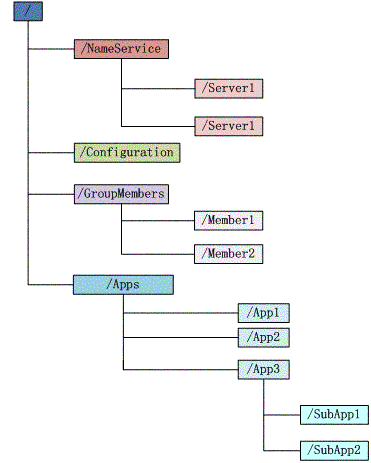
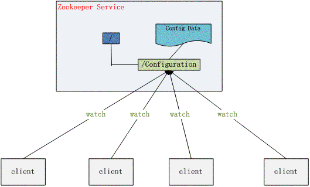

# zookeeper 简介
Zookeeper 分布式服务框架是 Apache Hadoop 的一个子项目，它主要是用来解决分布式应用中经常遇到的一些数据管理问题，如：统一命名服务、状态同步服务、集群管理、分布式应用配置项的管理等。

# zookeeper 单机使用
访问http://zookeeper.apache.org/releases.html 并下载最新版本的ZooKeeper，这里我使用的版本是3.4.8。

下载完成后解压缩。进入conf目录，创建zoo.cfg配置文件(可复制已有的zoo_sample.cfg修改)。
```
tickTime=2000
initLimit=10
syncLimit=5
dataDir=/tmp/zookeeper
clientPort=2181
```

说明一下几个配置项的意义(initLimit和syncLimit暂时先不管，后面有说明)：
* tickTime：这个时间是作为 Zookeeper 服务器之间或客户端与服务器之间维持心跳的时间间隔，也就是每个 tickTime 时间就会发送一个心跳。
* dataDir：顾名思义就是 Zookeeper 保存数据的目录，默认情况下，Zookeeper 将写数据的日志文件也保存在这个目录里。
* clientPort：这个端口就是客户端连接 Zookeeper 服务器的端口，Zookeeper 会监听这个端口，接受客户端的访问请求。

保存配置文件，返回进入bin目录，双击zkService.cmd启动服务，控制台看到如下启动信息：
```
...
2017-05-04 16:42:38,924 [myid:] - INFO  [main:ZooKeeperServer@787] - tickTime set to 2000
2017-05-04 16:42:38,924 [myid:] - INFO  [main:ZooKeeperServer@796] - minSessionTimeout set to -1
2017-05-04 16:42:38,925 [myid:] - INFO  [main:ZooKeeperServer@805] - maxSessionTimeout set to -1
2017-05-04 16:42:38,993 [myid:] - INFO  [main:NIOServerCnxnFactory@89] - binding to port 0.0.0.0/0.0.0.0:2181
```
再双击zkCli.cmd启动客户端，控制台显示如下信息：
```
...
WATCHER::
[zk: localhost:2181(CONNECTED) 0]
WatchedEvent state:SyncConnected type:None path:null
```

ZooKeeper客户端用于与ZooKeeper服务器进行交互，下面来进行简单的操作。

### 创建Znodes
创建具有给定路径的znode。

语法
```
create /path data
```
示例：
```
create /FirstZnode "myfirstzookeeper-app"
Created /FirstZnode
```

使用参数可以指定创建的节点模式CreateMode，CreateMode有下面几种：
* PERSISTENT：创建后只要不删就永久存在

* EPHEMERAL：会话结束年结点自动被删除，EPHEMERAL结点不允许有子节点

* SEQUENTIAL：节点名末尾会自动追加一个10位数的单调递增的序号，同一个节点的所有子节点序号是单调递增的

* PERSISTENT_SEQUENTIAL：结合PERSISTENT和SEQUENTIAL

* EPHEMERAL_SEQUENTIAL：结合EPHEMERAL和SEQUENTIAL

默认情况下，所有znode都是持久的。

创建Sequential znode，请添加-s标志，语法如下
```
create -s /path data
```
示例：
```
[zk: localhost:2181(CONNECTED) 1] create -s  /FirstZnode "second-data"
Created /FirstZnode0000000006
```
创建Ephemeral Znode，请添加-e标志，语法如下
```
create -e /path data
```
示例：
```
[zk: localhost:2181(CONNECTED) 2] create -e /SecondZnode "Ephemeral-data"
Created /SecondZnode
```
当客户端连接丢失时，临时znode将被删除。下面我们会通过退出ZooKeeper客户端，然后重新打开zkCli来验证。

### 获取数据
获取znode的数据，包括数据上次修改的时间，修改的位置等其他相关信息。

语法
```
get /path
```
示例：
```
[zk: localhost:2181(CONNECTED) 3] get /FirstZnode
myfirstzookeeper-app
cZxid = 0x151
ctime = Thu May 04 17:02:34 CST 2017
mZxid = 0x151
mtime = Thu May 04 17:02:34 CST 2017
pZxid = 0x151
cversion = 0
dataVersion = 0
aclVersion = 0
ephemeralOwner = 0x0
dataLength = 20
numChildren = 0
```
访问Sequential znode，必须输入znode的完整路径，语法如下
```
get /path00000000xx
```
示例：
```
[zk: localhost:2181(CONNECTED) 4] get /FirstZnode0000000006
second-data
cZxid = 0x152
ctime = Thu May 04 17:10:34 CST 2017
mZxid = 0x152
mtime = Thu May 04 17:10:34 CST 2017
pZxid = 0x152
cversion = 0
dataVersion = 0
aclVersion = 0
ephemeralOwner = 0x0
dataLength = 11
numChildren = 0
```
这里我们来验证Ephemeral Znode。

先获取一次:
```
[zk: localhost:2181(CONNECTED) 5] get /SecondZnode
Ephemeral-data
cZxid = 0x153
ctime = Thu May 04 17:13:21 CST 2017
mZxid = 0x153
mtime = Thu May 04 17:13:21 CST 2017
pZxid = 0x153
cversion = 0
dataVersion = 0
aclVersion = 0
ephemeralOwner = 0x15bd2a018370000
dataLength = 14
numChildren = 0
```
关闭zkCli命令行窗口，等待40s，重启客户端，再次尝试获取：
```
get /SecondZnode
Node does not exist: /SecondZnode
```
可以看到临时znode已经不存在了，而永久节点是存在的：
```
[zk: localhost:2181(CONNECTED) 1] get /FirstZnode
myfirstzookeeper-app
cZxid = 0x151
ctime = Thu May 04 17:02:34 CST 2017
mZxid = 0x151
mtime = Thu May 04 17:02:34 CST 2017
pZxid = 0x151
cversion = 0
dataVersion = 0
aclVersion = 0
ephemeralOwner = 0x0
dataLength = 20
numChildren = 0
```
这里说一下，客户端连接断了之后，ZK不会马上移除临时数据，只有当SESSIONEXPIRED之后，才会把这个会话建立的临时数据移除。

而SESSIONEXPIRED是取决于客户端和服务端两方面的。

zk server端timeout参数：
* tickTime：zk的心跳间隔（heartbeat interval），也是session timeout基本单位，单位为微妙。
* minSessionTimeout: 最小超时时间，zk设置的默认值为2*tickTime。
* maxSessionTimeout：最大超时时间，zk设置的默认值为20*tickTime。

我们配置文件的tickTime为2000，所以这里服务端最大超时时间为20*2000ms = 40s。

zk client端timeout参数：这里cmd命令行不清楚怎么设置，但是应该也有默认的值，不过默认值也不知道= =!。

查看zookeeper源码可知，服务端拿到客户端的超时时间后，是会做一些判断的，客户端超时时间实际限制在{2\*tickeTime, 20*tickTime}范围内。假设客户端设置了timeout为100s，实际40s就已经超时了；类似如果客户端设置timeout为1s，也要等到4s才超时。

回到我们的测试，建立临时节点，如果关闭客户端后立刻(4s内)连接上，临时节点仍然存在，而等待40s后session一定过期，临时节点就被删除了。


### 设置数据
设置指定znode的数据。

语法
```
set /path data-updated
```
示例：
```
[zk: localhost:2181(CONNECTED) 4] set /FirstZnode "myfirstzookeeper-app1.1"
cZxid = 0x151
ctime = Thu May 04 17:02:34 CST 2017
mZxid = 0x15d
mtime = Thu May 04 17:46:18 CST 2017
pZxid = 0x151
cversion = 0
dataVersion = 1
aclVersion = 0
ephemeralOwner = 0x0
dataLength = 23
numChildren = 0
```
查看结果：
```
[zk: localhost:2181(CONNECTED) 5] get /FirstZnode
myfirstzookeeper-app1.1
cZxid = 0x151
ctime = Thu May 04 17:02:34 CST 2017
mZxid = 0x15d
mtime = Thu May 04 17:46:18 CST 2017
pZxid = 0x151
cversion = 0
dataVersion = 1
aclVersion = 0
ephemeralOwner = 0x0
dataLength = 23
numChildren = 0
```
### 设置监听
当指定的znode或znode的子数据更改时，watch会显示通知。

语法
```
get /path [watch] 1
```
示例：
```
[zk: localhost:2181(CONNECTED) 6] get /FirstZnode 1
myfirstzookeeper-app1.1
cZxid = 0x151
ctime = Thu May 04 17:02:34 CST 2017
mZxid = 0x15d
mtime = Thu May 04 17:46:18 CST 2017
pZxid = 0x151
cversion = 0
dataVersion = 1
aclVersion = 0
ephemeralOwner = 0x0
dataLength = 23
numChildren = 0
```
设置了监听的节点被修改后，输出会稍微不同，带有watch信息
```
[zk: localhost:2181(CONNECTED) 7] set /FirstZnode "myfirstzookeeper-app1.2"

WATCHER::
cZxid = 0x151
WatchedEvent state:SyncConnected type:NodeDataChanged path:/FirstZnode

ctime = Thu May 04 17:02:34 CST 2017
mZxid = 0x15e
mtime = Thu May 04 17:52:14 CST 2017
pZxid = 0x151
cversion = 0
dataVersion = 2
aclVersion = 0
ephemeralOwner = 0x0
dataLength = 23
numChildren = 0
```

### 创建子节点
创建子节点类似于创建新的znode。唯一的区别是子节点znode的路径包含了父路径。

语法
```
create /parentpath/childpath data
```
示例：
```
[zk: localhost:2181(CONNECTED) 8] create /FirstZnode/Child1 "firstchildren"
Created /FirstZnode/Child1
[zk: localhost:2181(CONNECTED) 9] create /FirstZnode/Child2 "secondchildren"
Created /FirstZnode/Child2
```

### 查看子节点
查看znode所有的子节点。

语法
```
ls /path
```
示例：
```
[zk: localhost:2181(CONNECTED) 10] ls /FirstZnode
[Child2, Child1]
```
查看根目录下所有节点：
```
[zk: localhost:2181(CONNECTED) 11] ls /
[dubbo, FirstZnode0000000006, zookeeper, FirstZnode]
```

### 检查状态
查看指定znode的元数据。包含详细信息，如时间戳，版本号，ACL，数据长度和子节点znode。

语法
```
stat /path
```
示例：
```
[zk: localhost:2181(CONNECTED) 12] stat /FirstZnode
cZxid = 0x151
ctime = Thu May 04 17:02:34 CST 2017
mZxid = 0x15e
mtime = Thu May 04 17:52:14 CST 2017
pZxid = 0x160
cversion = 2
dataVersion = 2
aclVersion = 0
ephemeralOwner = 0x0
dataLength = 23
numChildren = 2
```

### 删除节点
删除指定的znode及其所有子节点。

语法
```
rmr /path
```
示例：
```
[zk: localhost:2181(CONNECTED) 13] rmr /FirstZnode
[zk: localhost:2181(CONNECTED) 14] get /FirstZnode
Node does not exist: /FirstZnode
```

还有一种删除，只能删除没有子节点的节点，语法：
```
delete /path
```
示例：
```
[zk: localhost:2181(CONNECTED) 17] create /myZnode "mydata"
Created /myZnode
[zk: localhost:2181(CONNECTED) 18] create /myZnode/child1 "child1data"
Created /myZnode/child1
[zk: localhost:2181(CONNECTED) 19] delete /myZnode
Node not empty: /myZnode
[zk: localhost:2181(CONNECTED) 20] delete /myZnode/child1
[zk: localhost:2181(CONNECTED) 21] delete /myZnode
[zk: localhost:2181(CONNECTED) 22] get /myZnode
Node does not exist: /myZnode
```


# zookeeper 数据模型
简单使用了zookeeper之后，我们发现其数据模型有些像操作系统的文件结构，结构如下图所示

1. 每个节点在zookeeper中叫做znode，并且其有一个唯一的路径标识，如/Server1节点的标识就为/NameService/Server1。
2. znode可以有子znode，并且znode里可以存数据，但是EPHEMERAL类型的节点不能有子节点。
3. znode中的数据可以有多个版本，比如某一个路径下存有多个数据版本，那么查询这个路径下的数据就需要带上版本。
4. znode可以是临时节点，一旦创建这个znode的客户端与服务器失去联系，这个znode也将自动删除。zookeeper的客户端和服务器通信采用长连接方式，每个客户端和服务器通过心跳来保持连接，这个连接状态称为session，如果这个session失效，临时znode也就删除了。
5. znode的目录名可以自动编号，如sznode0000000001已经存在，再创建sznode的话，将会自动命名为sznode0000000002。
6. znode可以被监控，包括这个目录节点中存储的数据的修改，子节点目录的变化等，一旦变化可以通知设置监控的客户端，这个功能是zookeeper对于应用最重要的特性，通过这个特性可以实现的功能包括配置的集中管理，集群管理，分布式锁等等。

# Zookeeper API
Znode是ZooKeeper核心组件，ZooKeeper API提供了方法来操纵znode。

客户端遵循以下步骤来与ZooKeeper进行清晰和干净的交互：
* 连接到ZooKeeper服务。ZooKeeper服务为客户端分配会话ID。
* 定期向服务器发送心跳。否则，ZooKeeper将设定会话ID过期，客户端需要重新连接。
* 只要会话ID处于活动状态，就可以获取/设置znode。
* 所有任务完成后，断开与ZooKeeper服务的连接。 如果客户端长时间不活动，则ZooKeeper服务将自动断开客户端。

示例：
```
import java.io.IOException;
import java.util.List;

import org.apache.zookeeper.CreateMode;
import org.apache.zookeeper.KeeperException;
import org.apache.zookeeper.WatchedEvent;
import org.apache.zookeeper.Watcher;
import org.apache.zookeeper.ZooDefs;
import org.apache.zookeeper.ZooKeeper;
import org.apache.zookeeper.data.Stat;

/**
 * Test Zookeeper
 *
 * @author tenny.peng
 */
public class TestZookeeper {

	public static void main(String[] args) {
		try {
			// 创建一个Zookeeper实例。param1:目标服务器地址和端口；param2:Session超时时间；param3:节点变化时的回调方法。
			ZooKeeper zk = new ZooKeeper("127.0.0.1:2181", 500000, new Watcher() {
				// 监控所有被触发的事件
				public void process(WatchedEvent event) {
					// dosomething
					System.out.println("监听事件： " + event.toString());
				}
			});

			// 创建一个节点。param1:节点路径；param2:节点数据；param3:权限控制；这里表示所有人都可以操作；param4:节点类型，这里为永久。
			zk.create("/FirstZnode", "my first zookeeper app".getBytes(), ZooDefs.Ids.OPEN_ACL_UNSAFE, CreateMode.PERSISTENT);

			// 查看一个节点是否存在。param1:znode路径；param2:是否监测(watch)查看的节点，重载方法：可传入自定义watch。
			Stat stat = zk.exists("/FirstZnode", true);
			System.out.println("version: " + stat.getVersion());

			// 获取一个节点的数据。param1:znode路径；param2:是否监测(watch)，重载方法：可传入自定义watch；param3:znode的元数据。
			byte[] b = zk.getData("/FirstZnode", true, stat);
			String data = new String(b);
			System.out.println(data);

			// 修改一个节点的数据。param1:znode路径；param2:节点数据；param3:znode当前的版本号，-1无视被修改的数据版本，直接改掉。每当数据更改时，ZooKeeper会更新znode的版本号。
			zk.setData("/FirstZnode", "my first zookeeper app1.1".getBytes(), stat.getVersion());
			stat = zk.exists("/FirstZnode", true);
			System.out.println("version: " + stat.getVersion());
			b = zk.getData("/FirstZnode", true, stat);
			data = new String(b);
			System.out.println(data);

			// 创建子节点，和创建节点一样。
			zk.create("/FirstZnode/child1", "child1 data".getBytes(), ZooDefs.Ids.OPEN_ACL_UNSAFE, CreateMode.PERSISTENT);
			zk.create("/FirstZnode/child2", "child2 data".getBytes(), ZooDefs.Ids.OPEN_ACL_UNSAFE, CreateMode.PERSISTENT);

			// 获取子节点。param1:znode路径；param2:是否监测(watch)，重载方法：可传入自定义watch。
			List<String> children = zk.getChildren("/FirstZnode", true);
			for (int i = 0; i < children.size(); i++) {
				System.out.println(children.get(i));
			}

			// 删除节点，如有子节点必须先删除子节点。param1:znode路径；param2:znode的当前版本，－1的话直接删除，无视版本。
			zk.delete("/FirstZnode/child1", -1);
			zk.delete("/FirstZnode/child2", -1);
			zk.delete("/FirstZnode", -1);

			// 关闭session
			zk.close();

		} catch (IOException e) {
			e.printStackTrace();
		} catch (KeeperException e) {
			e.printStackTrace();
		} catch (InterruptedException e) {
			e.printStackTrace();
		}

	}
}
```
结果：
```
监听事件： WatchedEvent state:SyncConnected type:None path:null
version: 0
my first zookeeper app
监听事件： WatchedEvent state:SyncConnected type:NodeDataChanged path:/FirstZnode
version: 1
my first zookeeper app1.1
child2
child1
监听事件： WatchedEvent state:SyncConnected type:NodeChildrenChanged path:/FirstZnode
监听事件： WatchedEvent state:SyncConnected type:NodeDeleted path:/FirstZnode
```

# zookeeper 集群
Zookeeper 不仅可以单机提供服务，同时也支持多机组成集群来提供服务。实际上 Zookeeper 还支持另外一种伪集群的方式，也就是可以在一台物理机上运行多个 Zookeeper 实例。

下面介绍伪集群模式的安装和配置：
1. 新建一个总文件夹zookeeperCluster用于存放集群；
2. zookeeperCluster文件夹下建立三个文件夹server1，server2，server3；
3. 每个server里面新建一个data文件夹和一个log文件夹，并复制一份单机的zookeeper的文件夹；
4. 每个server/data下新建一个myid文件并写入一个数字，server1就写1，server2写2，server3写3。Zookeeper 启动时会读取这个文件，拿到里面的数据与 zoo.cfg 里面的配置信息比较从而判断当前 server 到底是哪个 server。
5. 进入各个server/zookeeper/conf目录，编辑zoo.cfg。由于是在一台机器上部署多个server，每个server要用不同的clientPort，比如server1是2181，server2是2182，server3是2183，dataDir和dataLogDir也要修改成相应路径。
```
tickTime=2000
initLimit=10
syncLimit=4
dataDir=D:/devsoft/zookeeperCluster/server1/data
dataLogDir=D:/devsoft/zookeeperCluster/server1/log
clientPort=2181
server.1=127.0.0.1:2888:3888
server.2=127.0.0.1:2889:3889
server.3=127.0.0.1:2890:3890
```
6. 分别启动三个server/zookeeper/bin/zkServer.cmd。

说明一下集群的几个配置参数
* initLimit：这个配置项是用来配置 Zookeeper 接受客户端（这里所说的客户端不是用户连接 Zookeeper 服务器的客户端，而是 Zookeeper 服务器集群中连接到 Leader 的 Follower 服务器）初始化连接时最长能忍受多少个心跳时间间隔数。当已经超过 10 个心跳的时间（也就是 tickTime）长度后 Zookeeper 服务器还没有收到客户端的返回信息，那么表明这个客户端连接失败。总的时间长度就是 10*2000=20 秒。
* syncLimit：这个配置项标识 Leader 与 Follower 之间发送消息，请求和应答时间长度，最长不能超过多少个 tickTime 的时间长度，总的时间长度就是 4*2000=8 秒。
* server.A=B:C:D：其中 A 是一个数字，表示这个是第几号服务器；B 是这个服务器的 ip 地址；C 表示的是这个服务器与集群中的 Leader 服务器交换信息的端口；D 表示的是万一集群中的 Leader 服务器挂了，需要一个端口来重新进行选举，选出一个新的 Leader，而这个端口就是用来执行选举时服务器相互通信的端口。如果是伪集群的配置方式，由于 B 都是一样，所以不同的 Zookeeper 实例通信端口号不能一样，所以要给它们分配不同的端口号。

启动第一个server,这时会报大量错误。
```
2017-05-06 17:26:12,366 [myid:1] - INFO  [QuorumPeer[myid=1]/0:0:0:0:0:0:0:0:218
1:FastLeaderElection@852] - Notification time out: 800
```
没关系，因为现在集群只起了1台server，zookeeper服务器端起来会根据zoo.cfg的服务器列表发起选举leader的请求，因为连不上其他机器而报错。
我们再起第二个zookeeper服务，leader将会被选出，从而一致性服务开始可以使用，这是因为3台机器只要有2台可用就可以选出leader并且对外提供服务(2n+1台机器，可以容n台机器挂掉)。
```
2017-05-06 17:26:39,573 [myid:2] - INFO  [WorkerSender[myid=2]:QuorumPeer$Quorum
Server@149] - Resolved hostname: 127.0.0.1 to address: /127.0.0.1
```
再启动最后一个zookeeper服务。
```
2017-05-06 17:27:11,071 [myid:3] - INFO  [QuorumPeer[myid=3]/0:0:0:0:0:0:0:0:218
3:FileTxnSnapLog@240] - Snapshotting: 0x700000000 to D:\devsoft\zookeeperCluster
\server3\data\version-2\snapshot.700000000
```
开启一个客户端zkCli.cmd，可以看到成功连接集群中的master。
```
2017-05-06 17:27:11,071 [myid:3] - INFO  [QuorumPeer[myid=3]/0:0:0:0:0:0:0:0:218
3:FileTxnSnapLog@240] - Snapshotting: 0x700000000 to D:\devsoft\zookeeperCluster
\server3\data\version-2\snapshot.700000000
```
然后客户端就可以像之前单机一样进行各种操作。
```
ls /
[zookeeper]
[zk: localhost:2181(CONNECTED) 1] create /testZnode "testdata"
Created /testZnode
[zk: localhost:2181(CONNECTED) 2] ls /
[zookeeper, testZnode]
[zk: localhost:2181(CONNECTED) 3] delete /testZnode
[zk: localhost:2181(CONNECTED) 4] ls /
[zookeeper]
```

# ZooKeeper 典型的应用场景
Zookeeper 从设计模式角度来看，是一个基于观察者模式设计的分布式服务管理框架，它负责存储和管理大家都关心的数据，然后接受观察者的注册，一旦这些数据的状态发生变化，Zookeeper 就将负责通知已经在 Zookeeper 上注册的那些观察者做出相应的反应，从而实现集群中类似 Master/Slave 管理模式。

下面详细介绍这些典型的应用场景。
### 配置管理（Configuration Management）
配置的管理在分布式应用环境中很常见，例如同一个应用系统需要多台 PC Server 运行，但是它们运行的应用系统的某些配置项是相同的，如果要修改这些相同的配置项，那么就必须同时修改每台运行这个应用系统的 PC Server，这样非常麻烦而且容易出错。

像这样的配置信息完全可以交给 Zookeeper 来管理，将配置信息保存在 Zookeeper 的某个目录节点中，然后将所有需要修改的应用机器监控配置信息的状态，一旦配置信息发生变化，每台应用机器就会收到 Zookeeper 的通知，然后从 Zookeeper 获取新的配置信息应用到系统中。

比如将APP1的所有配置配置到/APP1 znode下，APP1所有机器一启动就对/APP1这个节点进行监控，并且实现回调方法Watcher，那么在zookeeper上/APP1 znode节点下数据发生变化的时候，每个机器都会收到通知，Watcher方法将会被执行，那么应用再取下数据即可。


### 集群管理（Group Membership）
Zookeeper 能够很容易的实现集群管理的功能，如有多台 Server 组成一个服务集群，那么必须要一个“总管”知道当前集群中每台机器的服务状态，一旦有机器不能提供服务，集群中其它集群必须知道，从而做出调整重新分配服务策略。同样当增加集群的服务能力时，就会增加一台或多台 Server，同样也必须让“总管”知道。

Zookeeper 不仅能够帮你维护当前的集群中机器的服务状态，而且能够帮你选出一个“总管”，让这个总管来管理集群，这就是 Zookeeper 的另一个功能 Leader Election。

它们的实现方式都是在 Zookeeper 上创建一个 EPHEMERAL 类型的目录节点，然后每个 Server 在它们创建目录节点的父目录节点上调用 getChildren(String path, boolean watch) 方法并设置 watch 为 true，由于是 EPHEMERAL 目录节点，当创建它的 Server 死去，这个目录节点也随之被删除，所以 Children 将会变化，这时 getChildren上的 Watch 将会被调用，所以其它 Server 就知道已经有某台 Server 死去了。新增 Server 也是同样的原理。

Zookeeper 如何实现 Leader Election，也就是选出一个 Master Server。和前面的一样每台 Server 创建一个 EPHEMERAL 目录节点，不同的是它还是一个 SEQUENTIAL 目录节点，所以它是个 EPHEMERAL_SEQUENTIAL 目录节点。之所以它是 EPHEMERAL_SEQUENTIAL 目录节点，是因为我们可以给每台 Server 编号，我们可以选择当前是最小编号的 Server 为 Master，假如这个最小编号的 Server 死去，由于是 EPHEMERAL 节点，死去的 Server 对应的节点也被删除，所以当前的节点列表中又出现一个最小编号的节点，我们就选择这个节点为当前 Master。这样就实现了动态选择 Master，避免了传统意义上单 Master 容易出现单点故障的问题。


# 总结
通过命令行和API使用了zookeeper的基本功能。Zoopkeeper 提供了一套很好的分布式集群管理的机制，即基于层次型的目录树的数据结构，并对树中的节点进行有效管理，从而可以设计出多种多样的分布式的数据管理模型。


参考链接：http://www.w3cschool.cn/zookeeper/
　　　　　http://www.blogjava.net/BucketLi/archive/2010/12/21/341268.html
　　　　　https://www.ibm.com/developerworks/cn/opensource/os-cn-zookeeper/