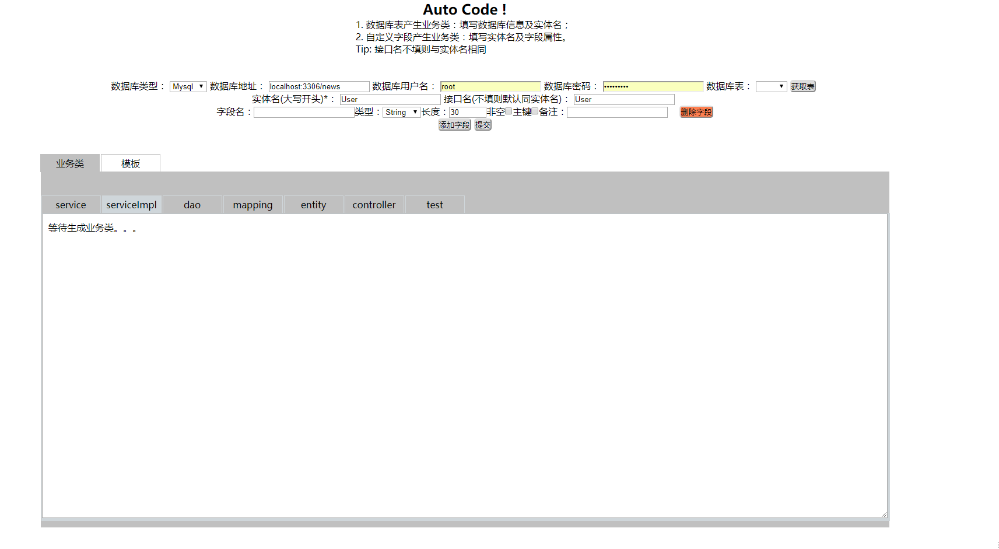
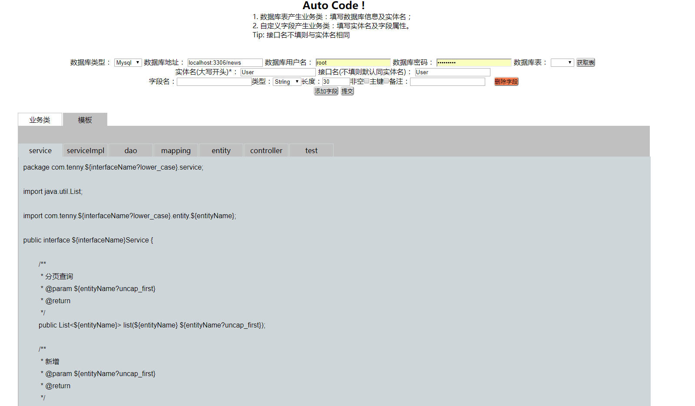
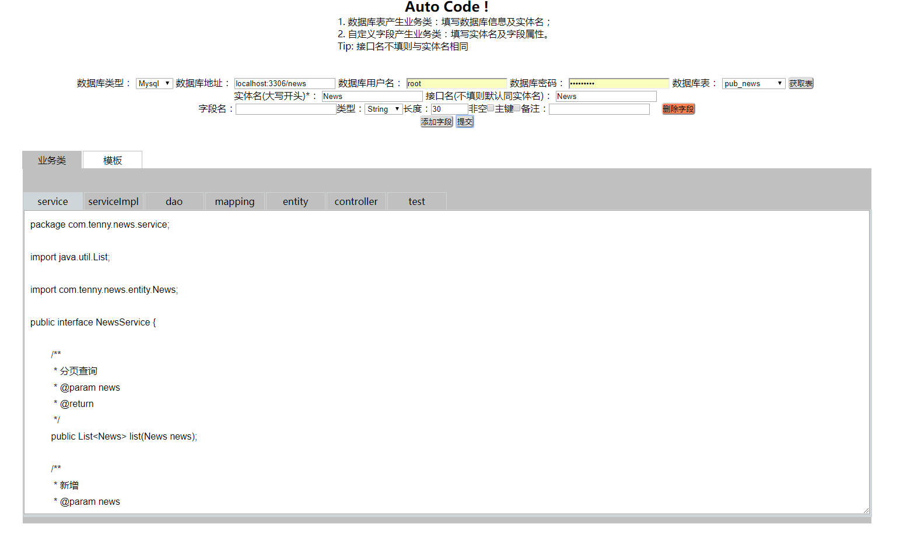
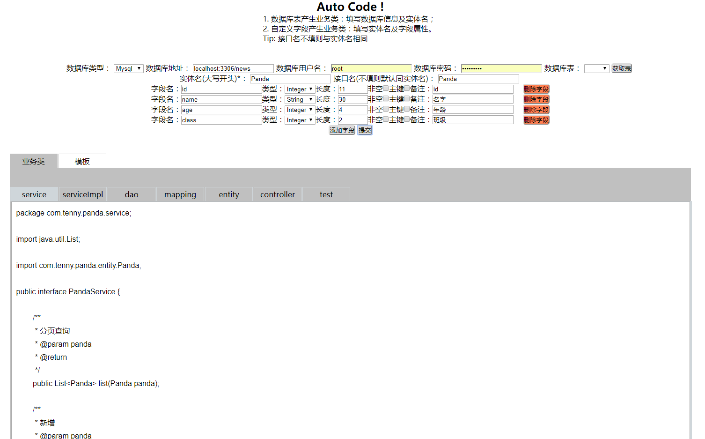
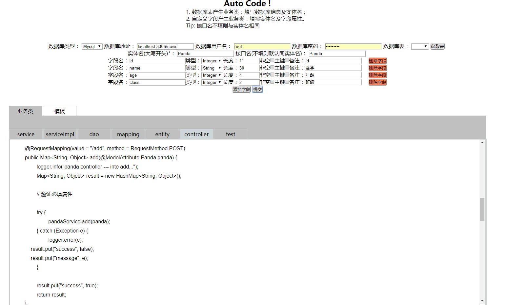

# 前言
因感概业务代码存在大量的增删改查功能，只是针对不同的表数据而已。故想有没有办法，在重复的相同代码中替换某些内容，于是按此思路搜寻，了解到有freemarker这个东西，一番学习后，特记录于此。

# Freemarker简介
FreeMarker是一款模板引擎： 一种基于模板和要改变的数据，并用来生成输出文本（HTML网页、电子邮件、配置文件、源代码等）的通用工具。即：输出=模板+数据。简单来说，其用法原理类似String的replace方法，或MessageFormat的format方法，都是在一定的代码中改变（替换）某些内容。不过FreeMarker更加强大，模板来源可以是外部文件或字符串格式，替换的数据格式多样，而且支持逻辑判断，如此替换的内容将更加灵活。

# 小例子
比如我们要产生实体类，我们将模板定义如下，模板文件名为entity.flt（flt是freemarker模板的后缀名）
```
package com.tenny.${interfaceName?lower_case}.entity;

import java.util.Date;

public class ${entityName} {

<#list params as param>
	// ${param.fieldNote}
    private ${param.fieldType} ${param.fieldName};

</#list>
<#list params as param>
	public void set${param.fieldName?cap_first}(${param.fieldType} ${param.fieldName}){
        this.${param.fieldName} = ${param.fieldName};
    }

    public ${param.fieldType} get${param.fieldName?cap_first}(){
        return this.${param.fieldName};
    }

</#list>
}
```
其中的${xxx}就是变量了，由外部传入。可以看到模板还有类似java for each循环的语法。

接下来我们要填充数据了。数据来源后面详细说，先假定我们有了数据。其格式为Map，内容为：
```
Map<String, Object> beanMap = new HashMap<String, Object>();
beanMap.put("beanName", "User");// 实体类名
beanMap.put("interfaceName", "User");// 接口名
List<Map<String, String>> paramsList = new ArrayList<Map<String, String>>();
for (int i = 0; i < 4; i++) {
      Map<String, String> tmpParamMap = new HashMap<String, String>();
      tmpParamMap.put("fieldNote", "fieldNote" + i);
      tmpParamMap.put("fieldType", "String");
      tmpParamMap.put("fieldName", "fieldName" + i);
      paramsList.add(tmpParamMap);
}
beanMap.put("params", paramsList);
```
最后我们使用模板替换数据(这里我的模板放在resources/model/下，目标文件放在resources/class/下)：
```
Configuration config = new Configuration();
config.setObjectWrapper(new DefaultObjectWrapper());
Template template = config.getTemplate("src/main/resources/model/entity.ftl", "UTF-8");
Writer out = new BufferedWriter(new OutputStreamWriter(new FileOutputStream("src/main/resources/class/User.java"), "UTF-8"));
template.process(rootMap, out);
out.flush();
out.close();
```
这样最后生成的User.java的内容大概如下：
```
package com.tenny.user.entity;

import java.util.Date;

public class User {

	// 主键id
    private Integer id;

	// 用户名
    private String username;

	// 密码
    private String password;

	// 用户类型#1、管理员；2、普通用户
    private Integer type;

	// 创建时间
    private Date createtime;

	public void setId(Integer id){
        this.id = id;
    }

    public Integer getId(){
        return this.id;
    }

	public void setUsername(String username){
        this.username = username;
    }

    public String getUsername(){
        return this.username;
    }

	public void setPassword(String password){
        this.password = password;
    }

    public String getPassword(){
        return this.password;
    }

	public void setType(Integer type){
        this.type = type;
    }

    public Integer getType(){
        return this.type;
    }

	public void setCreatetime(Date createtime){
        this.createtime = createtime;
    }

    public Date getCreatetime(){
        return this.createtime;
    }

}
```

# 补充
其实上面已经基本将Freemarker的用法展现了。但是我们还可以做更多改进。

## 使用数据库作为数据来源
模板中要替换的数据，我们可以从外部手动输入，然后由程序拼装成模板引擎需要的格式。但因为我们最开始也说了，大部分相同的是增删改查，不同的是业务数据库表，所以我们可以直接将数据库表字段作为数据来源。

假如你使用的是mysql，可以写一个mysql工具类，获取数据库字段信息
```
package utils;

import java.sql.Connection;
import java.sql.DatabaseMetaData;
import java.sql.DriverManager;
import java.sql.ResultSet;
import java.sql.SQLException;
import java.sql.Statement;
import java.util.ArrayList;
import java.util.HashMap;
import java.util.List;
import java.util.Map;

public class MysqlUtil {
	private static String DRIVER_CLASS = "com.mysql.jdbc.Driver";
    private static String DATABASE_URL = "jdbc:mysql://localhost:3306/news";
    private static String DATABASE_URL_PREFIX = "jdbc:mysql://";
    private static String DATABASE_USER = "root";
    private static String DATABASE_PASSWORD = "tenny123";
    private static Connection con = null;
    private static DatabaseMetaData dbmd = null;

    /**
     * 初始化数据库链接
     * @param db_url 数据库地址(ex: localhost:3306/news)
     * @param db_user 用户名
     * @param db_pw 密码
     */
    public static void init(String db_url, String db_user, String db_pw){
    	try {
    		DATABASE_URL = DATABASE_URL_PREFIX + db_url;
    		DATABASE_USER = db_user;
    		DATABASE_PASSWORD = db_pw;
    		Class.forName(DRIVER_CLASS);
    		con = DriverManager.getConnection(DATABASE_URL, DATABASE_USER, DATABASE_PASSWORD);
    		dbmd = con.getMetaData();
		} catch (Exception e) {
			e.printStackTrace();
		}
    }

    /**
     * 获取当前用户所有表
     * @return
     */
    public static List<String> getTables(){
    	List<String> tables = new ArrayList<String>();

    	try {
			ResultSet rs = dbmd.getTables(null, DATABASE_USER, null, new String[] { "TABLE" });
			while (rs.next()) {
				tables.add(rs.getString("TABLE_NAME"));
			}
		} catch (SQLException e) {
			e.printStackTrace();
		}

    	return tables;
    }

    /**
     * 获取表字段信息
     * @param tableName
     * @return
     */
    public static List<Map<String,String>> getTableCloumns(String tableName){
    	List<Map<String,String>> columns = new ArrayList<Map<String,String>>();
    	try{
            Statement stmt = con.createStatement();

            String sql = "select column_name, data_type, column_key, is_nullable, column_comment from information_schema.columns where table_name='" + tableName + "'and table_schema='" + DATABASE_URL.substring(DATABASE_URL.lastIndexOf("/") + 1, DATABASE_URL.length()) + "'";
            ResultSet rs = stmt.executeQuery(sql);
            while (rs.next()){
                HashMap<String,String> map = new HashMap<String,String>();
                map.put("columnName", rs.getString("column_name"));
                map.put("dataType", rs.getString("data_type"));
                map.put("isKey", ParamUtil.isEmpty(rs.getString("column_key"))?"false":"true");
                map.put("notNull", rs.getString("is_nullable").equals("YES")?"false":"true");
                map.put("comment", rs.getString("column_comment"));
                columns.add(map);
            }
        }
        catch (SQLException e){
            e.printStackTrace();
        }finally{
        	if(null != con){
	            try {
	        		con.close();
				} catch (SQLException e) {
					e.printStackTrace();
				}
        	}
        }
		return columns;
    }

}
```
获取了数据表字段信息，再加上自己需要的一些属性，就可以给模板引擎生成最终代码文件了。

## 将freemarker转为字符串模板
还可以在一开始就将模板数据读取出来，存放在内存中。
```
/**
	 * 将模板内容转成字符串
	 * @param modle 模板名【eg：entity.ftl】
	 * @return
	 */
	public static String file2Str(String modle){
		StringBuffer buffer = new StringBuffer();
		try {
			BufferedReader br = new BufferedReader(new FileReader("/WEB-INF/templates/" + model));
			String line = "";
			while((line = br.readLine()) != null){
				buffer.append(line).append(System.getProperty("line.separator"));// 保持原有换行格式
			}
			br.close();
		} catch (FileNotFoundException e) {
			e.printStackTrace();
		} catch (IOException e) {
			e.printStackTrace();
		}
		return buffer.toString();
	}
```
当然，利用字符串模板填充数据的写法有些不同
```
Configuration config  = new Configuration();
StringTemplateLoader stringTemplateLoader = new StringTemplateLoader();
stringTemplateLoader.putTemplate("entity", "this is a template of ${entityName}");
config.setTemplateLoader(stringTemplateLoader);

StringWriter stringWriter = new StringWriter();
Template template = config.getTemplate("entity", "UTF-8");
Writer out = new BufferedWriter(stringWriter);
template.process(rootMap, out);
out.flush();
out.close();
return stringWriter.toString();
```
这样可以将其输入到html页面观看。如果需要的话，还可以随时修改模板，后台接收前端的字符串模板。如此，模板和数据都可以随意定制，岂不是更加灵活方便。

## 其他
有了以上的认知，我们可以做一个页面，输入数据库参数后，选中某个表，就可以生成关于改表的增删改查代码。或者在页面上添加字段，用这些字段来生成代码。这个就可以自由发挥了~

帖几张我自己的页面截图（没啥样式，吃藕勿喷）

我已经将模板转换成字符串输出了，这样方便查看（其实直接看模板文件也一样= =!）

点击获取表，后台就根据数据库属性查询列表，然后我们选择某一个表，前端自动填充"实体名"和"接口名"属性,一般情况无需修改，点击提交，当当~我们的代码就出来了


当然还可以自定义字段，比如我们不选表，也就是说不用数据库作为来源，在页面上添加几个字段




如果你也使用spring mvc，可以和我一样，设定好多个模板后，一次性将controller-service-serviceImpl-dao-entity-mapping-test全部产生。后面甚至可以继续设定目录或包，产生的代码就可以直接使用啦。

# 总结
嗯，一句话，模板+数据=最终代码。

模板根据目标代码制定，数据来源我们根据实际情况获取，如此便可diy自己的autocode。

我的autocode地址：https://github.com/tenny-peng/autocode

参考链接：http://www.cnblogs.com/yejg1212/p/4322452.html
　　　　　http://blog.csdn.net/xiekuntarena/article/details/53032907
　　　　　http://blog.csdn.net/5iasp/article/details/27181365
