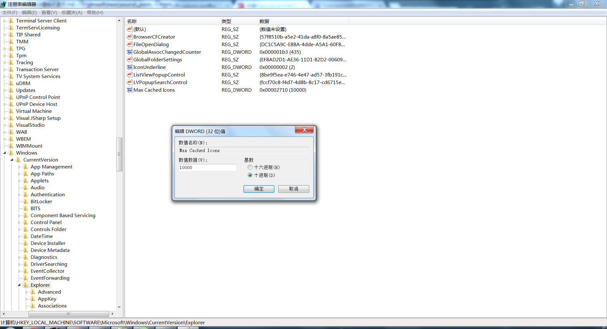
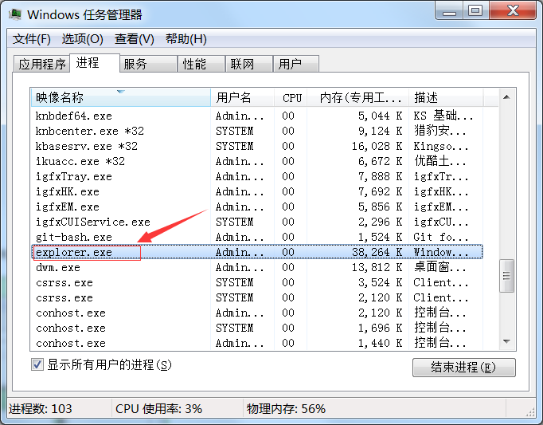
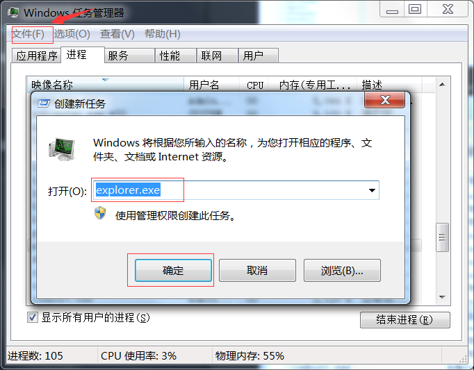

1. win + r 打开运行，输入regedit.exe打开注册表

2. 找到HKEY_LOCAL_MACHINE\Software\Microsoft\Windows\CurrentVersion\Explorer

3. 修改符串值 "Max Cached Icons" (如没有则新建)值为 "10000"(切换到十进制)。

4. Ctrl + Alt + Del 打开任务管理器,找到explorer.explorer

5. 右键选中explorer.exe，在弹出选项中选择"结束进程",这个时候会发现电脑底部状态栏没有了，不用担心。

6. 任务管理器上方的"文件"选项，点击"新建任务(运行)"，输入explorer.exe，确定即可。

由于Windows Explorer Shell 支持的 Overlay Icon 最多 15 个，Windows 自身使用了 4 个，只剩 11 个可扩展使用。我们在这里调节了它的最大图标数。
explorer.exe是Windows程序管理器或者文件资源管理器，它用于管理Windows图形壳，包括桌面和文件管理，重启explorer.exe就可以看到我们的修改了。
